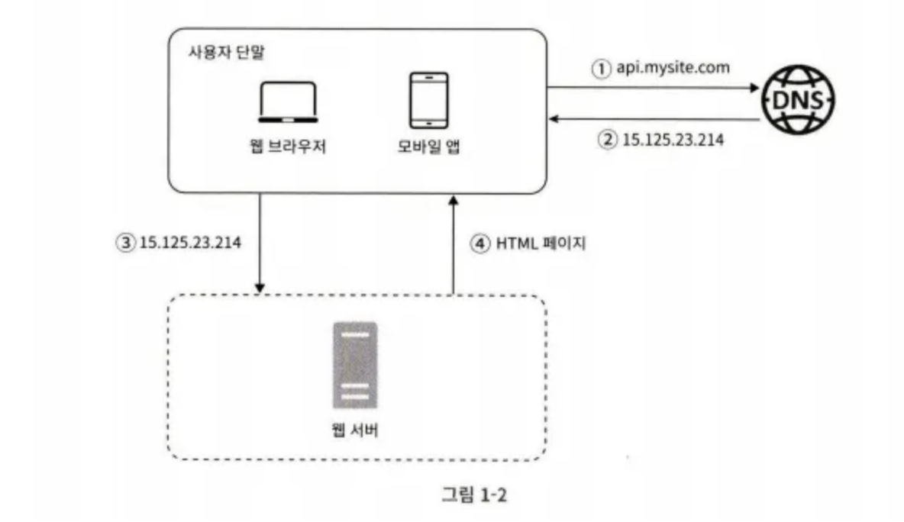
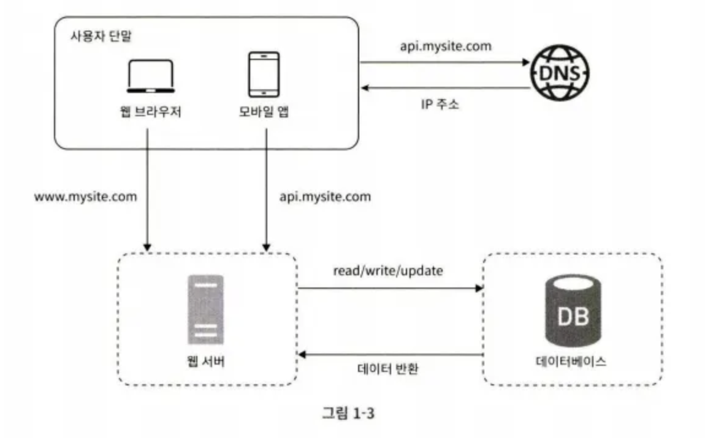
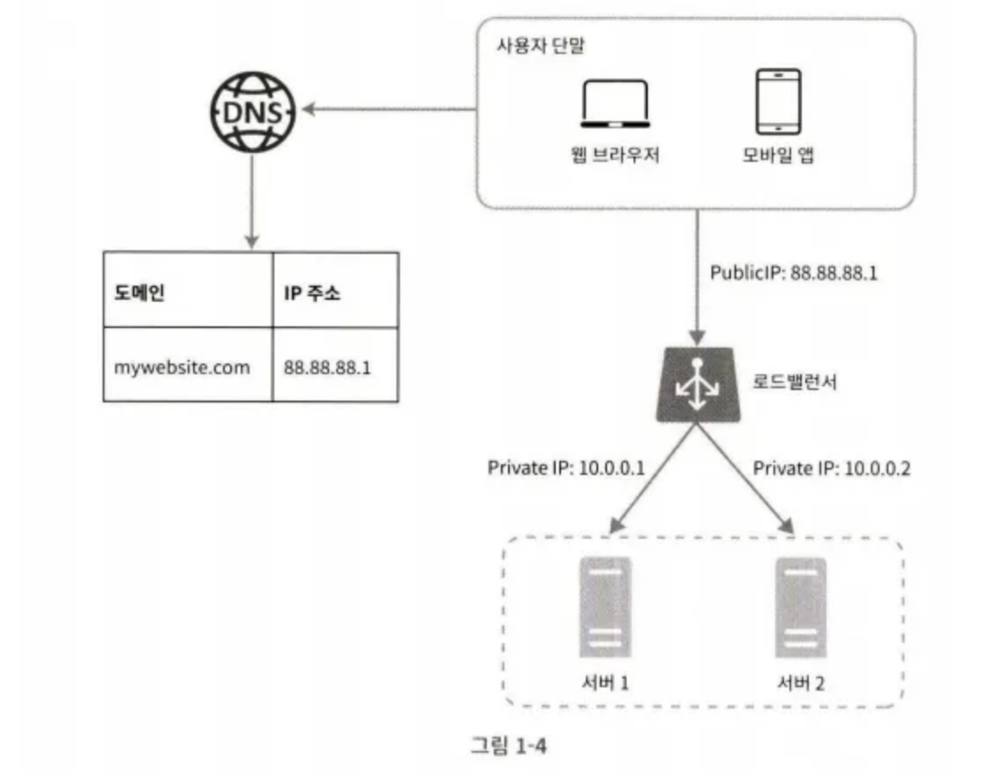
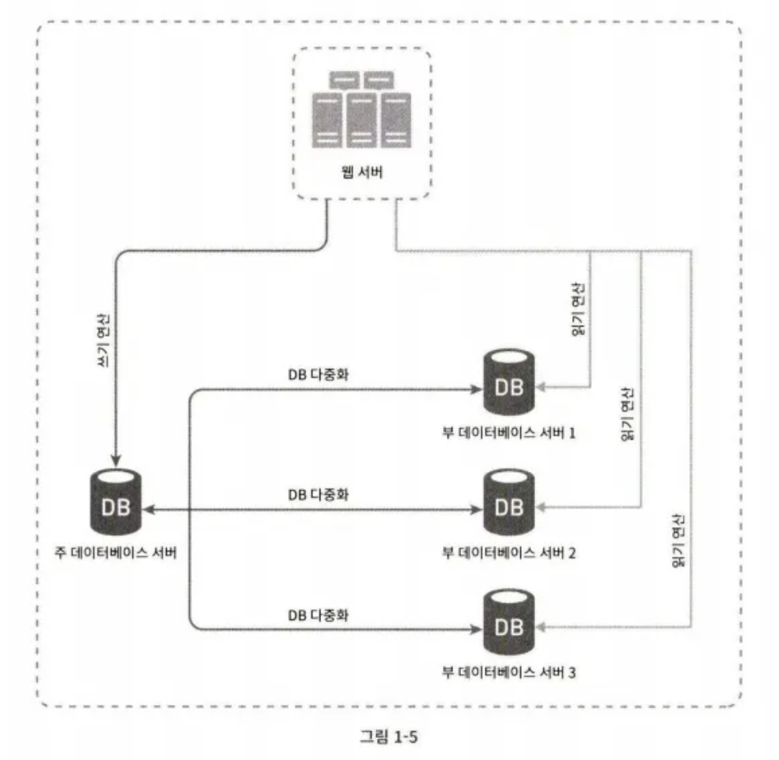
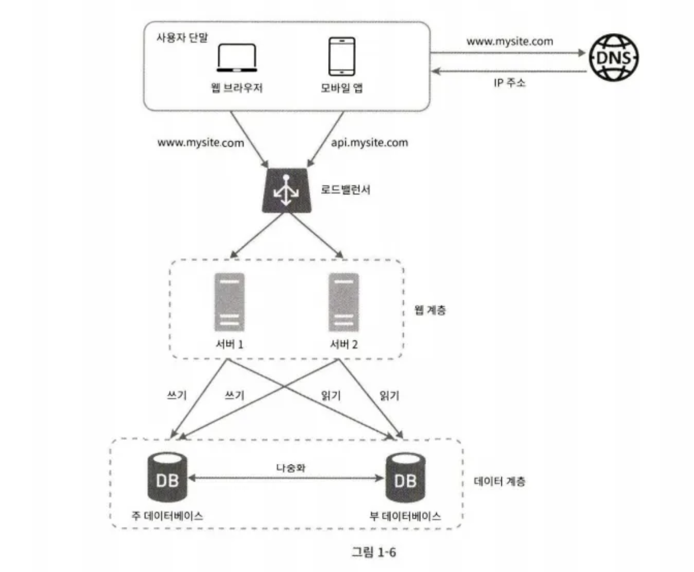
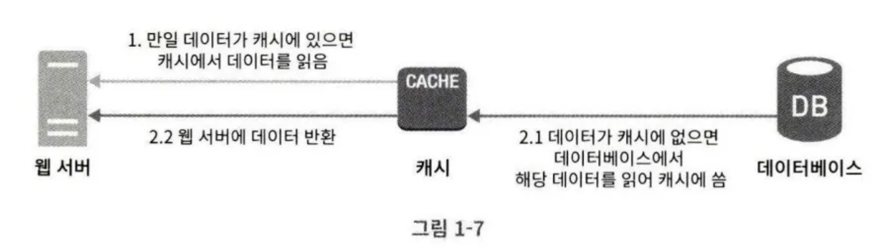
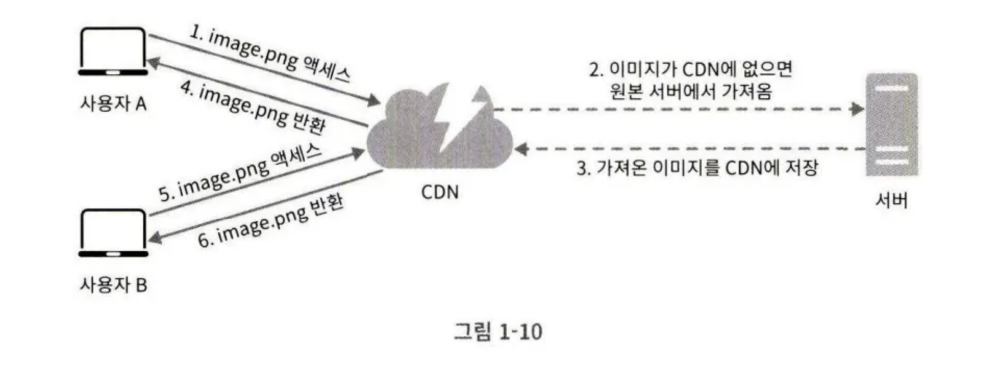
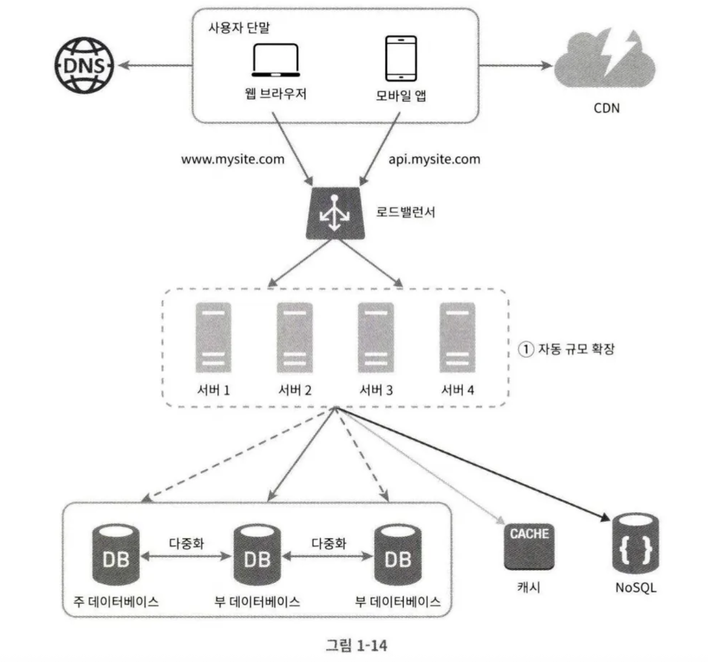
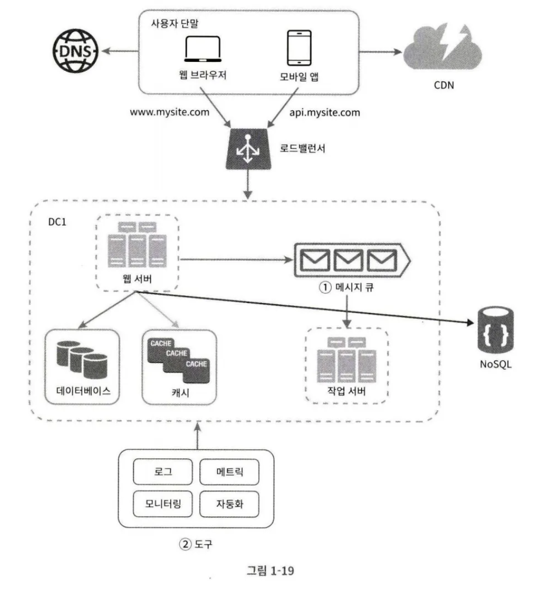
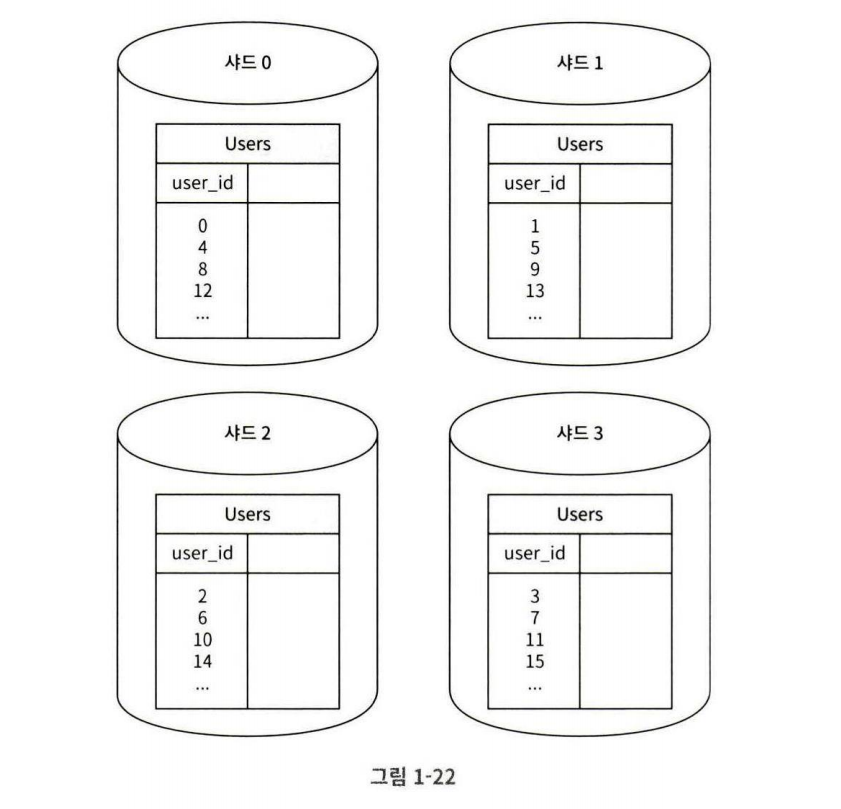

# 1장 사용자 수에 따른 규모 확장성
## 단일 서버

모든 컴포넌트가 단 한 대의 서버에서 실행되는 시스템 구조



사용자의 요청 흐름

1. 사용자가 도메인 이름을 이용하여 웹사이트 접속한다. 이때 도메인 이름을 DNS 에 질의하여 IP 주소로 변환하는 과정이 필요하다. (DNS 는 보통 제 3사업자가 제공하는 서비스를 이용하므로 우리의 시스템 일부는 아니다.)
2. DNS 조회 결과로 IP 주소가 반환된다.
3. 해당 IP 주소로 http 요청이 전달된다.
4. 요청을 받은 웹 서버는 html 페이지나 JSON 응답을 반환한다.

실제 요청이 어디로부터 오는가. 요청은 두 가지 단말, 하나는 웹/앱이고 다른 하나는 모바일 앱에서 온다.
- 웹 애플리케이션: 비즈니스 로직, 데이터 저장 등을 처리하는 서버 구현용 언어(java, python)를 사용하며, 프레젠테이션 용으로는 클라이언트 구현용 언어(html, javascript emd)를 사용한다.
- 모바일 앱: 앱과 웹 서버간 통신은 http 프로토콜로 이루어진다. http 통신으로 반환되는 응답 데이터의 포맷은 보통 JSON(JavaScript Object Notation)이 간결함 덕에 널리 쓰인다.

## 데이터베이스

사용자가 늘면 서버 하나로는 충분하지 않고 여러 서버를 두어야 한다. 웹/모바일 트래픽 처리 서버(웹 계층) 과 데이터베이스 서버(데이터 계층)을 분리하면 각각을 독립적으로 확장할 수 있다.



**어떤 데이터베이스를 사용할 것인가?**

1. 관계형 데이터베이스(RDBMS)
    - MySQL, Oracle, PostgreSQL 등
    - 테이블, 열, 컬럼으로 데이터를 표현
    - 여러 테이블을 관계에 따라 조인이 가능하다.

 2. 비관계형 데이터베이스(No-SQL)

- CouchDB, Neo4j, Cassandra, HBase, 아마존 Dynamo 등
- 키-값 저장소, 그래프 저장소, 컬럼 저장소, 문서 저장소 4가지로 분류됨
- 일반적으로 조인 연산을 지원하지 않음

**NoSQL 이 바람직한 선택인 경우**

- 아주 낮은 응답 지연 시간(latency)가 요구됨
- 다루는 데이터가 비정형이라 관계형 데이터가 아님
- 데이터를 직렬화하거나 역직렬화할 수 있기만 하면 됨
- 아주 많은 양의 데이터를 저장할 필요가 있음

```
Graph Database (Neo4j)

데이터가 서로 복잡하게 연결되어 있고, 그 데이터가 다른 데이터와 어떻게 연결되고 참조하는지를 표현해야 할때 적용하면 효과적이다. 전통적인 RDBMS에서는 다대다의 관계인 경우를 말한다. 실시간 추천엔진, 콘텐츠 및 자산관리 시스템, ID 및 엑세스 관리 시스템, 규정 준수 및 위험관리 솔루션, 소셜네트워크와 같은 관계를 보고자 할때 사용한다.

**수많은 조인을 줄여줌**
```

## 수직적 규모 확장  vs 수평적 규모 확장

“스케일 업” 이라고 하는 수직적 규모 확장 (vertical scaling) 프로세스는 서버에 고사양 자원 (cpu, ram 업그레이드 등)을 추가하는 행위를 말한다. 반면, “스케일 아웃” 이라고 하는 수평적 규모 확장 프로세스는 더 많은 서버를 추가하여 성능을 개선하는 행위를 말한다.

서버로 유입되는 트래픽의 양이 적은 경우엔 수직적 확장이 단순하여 좋지만, 몇 가지 심각한 단점이 존재한다.

- 수직적 규모 확장은 한계가 있다. 한 대의 서버에 CPU 나 메모리를 무한대로 증설할 순 없다.
- 수직적 규모 확장은 장애에 대한 자동복구(failover) 방안이나 다중화(re-dundancy) 방안을 제시하지 않는다. 한 대의 서버에 장애가 발생하면 웹은 완전히 중단된다. 즉, 웹 서버에 접속이 불가능하다.

따라서, 대규모 애플리케이션에선 로드 밸런서를 도입하여 수평적 규모 확장을 하는 것이 적절하다.

### 로드 밸런서(load balancer)

부하 분산 집합(load balancing set)에 속한 웹 서버들에게 트래픽 부하를 고르게 분산하는 역할을 한다.



동작 방식

- 사용자는 로드밸런서의 공개 IP 주소로 접속 (DNS 도 로드밸런서의 주소를 반환한다.)
- 따라서, 웹 서버는 클라이언트의 접속을 직접 처리하진 않는다.
- 보안을 위해 서버 간 통신에는 사설 IP 주소가 이용된다.
    - 사설 IP는 같은 네트워크에 속한 서버 간의 통신에만 쓰일 수 있는 IP로, 따라서 인터넷을 통해서는 접속이 불가능하다. 로드 밸런서는 웹 서버와 통신하기 위해 사설 IP를 사용한다.

부하 분산 집합에 하나의 웹 서버를 추가하면 장애를 자동복구하지 못하는 문제(no failover)는 해소되며, 웹 계층의 가용성이 향상된다.

- 서버 1이 다운되면 모든 트래픽은 서버 2로 전송된다. 따라서 아예 웹 사이트 자체가 다운되는 일을 방지한다.
- 웹 사이트로 유입되는 트래픽이 가파르게 증가하면 두 대의 서버로도 감당할 수 없는 시점이 오는데, 로드 밸런서가 있으므로 서버 한 대만 추가하면 자동으로 트래픽을 분산할 것이다.

하지만? 이는 웹 계층 서버만 증설한 것이지 데이터베이스 서버는 아직 하나이다. 따라서 역시 장애의 자동복구나 다중화를 지원하진 못한다. 

___

### 데이터베이스 다중화

데이터베이스를 주(Master)-부(Slave) 관계를 설정하고 데이터 원본은 주 서버에, 사본은 부 서버에 저장하는 방식이다. 이때,  `쓰기 연산`은 `Master`에서만 지원하고, `읽기 연산`은 `Slave`에서만 지원한다.

대부분의 애플리케이션은 읽기 연산의 비중이 쓰기 연산보다 훨씬 높으므로 부 데이터베이스 수가 많다.



**데이터베이스 다중화의 장점**

- 더 나은 성능: 데이터 변경 연산은 주 서버로,  읽기 연산은 부 서버로 분산된다. 따라서 병렬로 처리될 수 있는 질의의 수가 늘어나므로, 성능이 좋아진다.
- 안정성(reliability): 자연 재해 등의 이유로 데이터베이스 서버 가운데 일부가 파괴되어도 데이터는 보존된다. 데이터를 지역적으로 떨어진 여러 장소에 다중화시킬 수 있기 때문이다.
- 가용성(availability): 데이터를 여러 지역에 복제해둠으로써 하나의 서버에 장애가 발생해도 다른 서버에 데이터가 있으므로 서비스 운영을 지속시킬 수 있다.

**데이터베이스 서버 하나가 다운되었을 때 어떤 상황이 발생하는가?**

- 부 서버 한 대뿐인데 부 서버가 다운된 경우
    - 읽기 연산은 주 서버가 대신 담당한다.
    - 또는 즉시 다른 새로운 부 서버가 대체할 것이다.
- 부 서버가 여러 개인 데 부 서버가 다운된 경우
    - 읽기 연산이 나머지 부 서버들로 분산된다.
    - 새로운 부 서버가 장애 서버를 대체할 것이다.
- 부 서버 한대가 존재하는 데 주 서버가 다운된 경우
    - 남아있는 해당 부 서버가 새로운 주 서버가 될 것이다.
    - 새로운 부 서버가 추가될 것이다.
    - 만약, 부 서버에 보관된 데이터가 최신 상태가 아니라면 없는 데이터는 복구 스크립트를 돌려 추가한다.
    - 다중 마스터나 원형 다중화 방식이 존재 (하지만, 매우 복잡하다.)

**로드밸런서와 데이터베이스 다중화를 고려한 설계**



1. 사용자는 DNS 로부터 로드밸런서의 공개 IP 주소를 받는다.
2. 사용자는 해당 IP 주소를 사용해 로드밸런서에 접속한다.
3. http 요청은 서버 1이나 서버 2로 전달된다.
4. 웹 서버는 사용자의 데이터를 부 데이터베이스 서버에서 읽어온다.
5. 웹 서버는 데이터 변경 연산은 주 데이터베이스로 전달한다. (생성, 삭제, 갱신)

이상 웹 계층과 데이터베이스 계층이었다.

응답 시간(latency)은 캐시를 붙이고 정적 콘텐츠를 CDN 으로 옮기면 개선할 수 있다.

## 캐시

캐시는 값비싼 연산 결과 또는 자주 참조되는 데이터를 메모리 안에 두고, 뒤 이은 요청이 보다 빨리 처리될 수 있도록 하는 저장소이다. 애플리케이션의 성능은 데이터베이스를 얼마나 자주 호출하느냐에 크게 좌우하는데, 캐시는 그런 문제를 완화할 수 있다.

### 캐시 계층

캐시 계층(cache tier)은 데이터가 잠시 보관되는 곳으로 데이터베이스보다 훨씬 빠르다. 별도의 캐시 계층을 두면 성능이 개선될 뿐 아니라 데이터베이스의 부하를 줄일 수 있고, 캐시 계층의 규모를 독립적으로 확장시키는 것도 가능하다.



1. 요청을 받은 웹 서버는 캐시에 응답이 저장되어 있는지 확인
2. 캐시에 저장되어 있다면 해당 데이터를 바로 클라이언트에게 반환한다.
3. 없는 경우엔 데이터베이스에 쿼리를 날려 데이터를 찾아 캐시에 저장하고 클라이언트에게 반환한다.

⇒ 읽기 주도형 캐시 전략(read-through caching strategy) 라고 부른다.

### 캐시 사용 시 유의할 점

- 데이터 갱신은 자주 일어나지 않지만 참조가 빈번하게 일어난다면 고려해볼 만하다.
- 캐시는 휘발성 메모리에 두므로, 영속적으로 보관할 데이터는 두면 안된다.
- 데이터의 만료는? 만료된 데이터는 캐시에서 삭제되어야 한다.
    - 만료 정책이 없는 경우 데이터는 계속 캐시에 남게 된다.
    - 만료 기한이 너무 짧아도 데이터를 DB 에서 너무 자주 읽게 될 것이다.
    - 만료 기한이 너무 길어도, 최신성이 반영 안되어 원본과 차이가 날 가능성이 높아진다.
- 데이터 저장소의 원본과 캐시 내의 사본의 일관성을 유지해야 한다.
    - 저장소의 원본을 갱신하는 연산과 캐시를 갱신하는 연산이 단일 트랜잭션으로 처리되지 않으면 일관성이 깨질 수 있다.
- 캐시 서버를 한 대만 두는 경우 해당 서버는 단일 장애 지점(Single Point of Failure, SPOF)이 되어버릴 가능성이 있다.
    - 단일 장애 지점의 정의: 어떤 특정 지점에서의 장애가 전체 시스템의 동작을 중단시켜버릴 수 있는 경우
    - SPOF 를 피하기 위해선 여러 지역에 걸져 캐시 서버를 분산시켜야 한다.
- 캐시 메모리의 크기?
    - 너무 작으면 액세스 패턴에 따라서는 데이터가 너무 자주 캐시에서 밀려나 캐시의 성능이 떨어진다.
    - 해결 방법은 캐시 메모리를 과할당(overprovision)하는 것이다.
    - 이렇게 하면 캐시에 보관될 데이터가 갑자기 늘어났을 때의 문제를 방지할 수 있다.
- 캐시의 데이터 방출(eviction) 정책은 무엇인가
    - 캐시가 꽉 차면 추가로 데이터를 넣어야 하는 경우 데이터를 방출해야 한다.
    - LRU: 가장 많이 쓰이는 정책으로, 가장 오래된 데이터를 내보내는 정책이다.
    - LFU: 사용된 빈도가 가장 낮은 데이터를 내보내는 정책
    - FIFO: 가장 먼저 캐시에 들어온 데이터를 가장 먼저 내보내는 정책
    

## 콘텐츠 전송 네트워크(CDN)

CDN은 정적 콘텐츠를 전송하는 데 쓰이는, 지리적으로 분산된 서버의 네트워크이다. 이미지, 비디오, CSS, JavaScript 파일 등을 캐시할 수 있다. 동적 컨텐츠 캐싱은 상대적으로 새로운 개념으로서, 요청 경로, 질의 문자열(쿼리 스트링), 쿠키, 요청 헤더 등의 정보에 기반하여 HTML 페이지를 캐시하는 것이다.

사용자가 웹 사이트를 방문하면 해당 사용자에게 가장 가까운 CDN 서버가 정적 콘텐츠를 전달한다. 사용자가 CDN 서버로부터 멀면 멀수록 웹사이트는 천천히 로드될 것이다.

**CDN이 어떻게 사이트 로딩 시간을 개선할 수 있을까**




1. 사용자 A가 이미지 URL을 이용해 image.png 에 접근한다. URL 의 도메인은 CDN 서비스 사업자가 제공한 것이다. (CDN 사업자 AWS Cloudfront, Akamai 등)
2. CDN 서버의 캐시에 해당 이미지가 없는 경우, 서버는 원본 서버에 요청하여 파일을 가져온다. 원본 서버는 웹 서버일 수도 있고 S3 같은 온라인 저장소일 수도 있다.
3. 원본 서버가 파일을 CDN 서버에 반환한다. 응답의 http 헤더에는 해당 파일이 얼마나 오래 캐시될 수 있는 지를 설명하는 TTL 값이 있다.
4. CDN 서버는 파일을 캐시하고 사용자 A에게 반환한다.
5. 사용자 B가 같은 이미지에 대한 요청을 CDN 서버에 전송한다.
6. 만료되지 않은 이미지에 대한 요청은 캐시를 통해 처리된다.

### CDN 사용 시 고려해야 할 사항

- 비용: CDN은 보통 제 3 사업자에 의해 운영되므로 데이터 전송 양에 따라 요금 지불 필요
- 적절한 만료 시한 설정: 너무 길면 콘텐츠의 신선도는 떨어지고 너무 짧으면 원본 서버에 빈번히 접속하게 됨
- CDN 장애 대처 방안:
    - 즉, CDN 서버가 다운된 경우 웹 애플리케이션이 어떻게 동작할 지에 대한 방안 필요
    - 일시적으로 CDN이 응답하지 않으면, 원본 서버로부터 직접 컨텐츠를 가져오는 것이 필요할 수 있다.
- 콘텐츠 무효화 방법: 아직 만료되지 않은 콘텐츠도 다음과 같은 방법으로 CDN 에서 제거할 수 있다.
    - CDN 서비스 사업자가 제공하는 API 이용
    - 콘텐츠의 다른 버전을 서비스하도록 오브젝트 버저닝(object versioning) 이용. 콘텐츠의 새로운 버전 지정을 위해선 URL 마지막에 버전 번호를 인자로 부여, ex) image.png?v=2

CDN과 캐시가 추가된 시스템 설계

1. 정적 콘텐츠(JS, CSS, 이미지 등)은 더 이상 웹 서버를 통해 서비스하지 않고 CDN을 통해 제공하여 나은 성능을 보장
2. 캐시가 데이터베이스 부하를 줄여준다.

## 무상태(stateless) 웹 계층

웹 계층을 수평적으로 확장하는 방법을 고민해보아야 한다. 이를 위해선 사용자 세션 데이터와 같은 상태 정보를 웹 계층에서 제거하여야 한다. 바람직한 전략은 상태 정보를 관계형 데이터베이스나 NoSQL 같은 지속성 저장소에 보관하고, 필요할 때 가져오도록 하는 것이다. 이렇게 구성된 웹 계층을 무상태 웹 계층이라고 부른다.

### 상태 정보 의존적인 아키텍처

상태 정보를 보관하는 서버는 클라이언트 정보, 즉 상태를 유지하여 요청들 사이에 공유되도록 한다. 사용자 A의 세션 정보는 http 요청이 전달된 서버 1에만 저장되므로 사용자 A를 인증하기 위해 http 요청은 반드시 서버 1로 전송되어야 한다. 서버 2로 전송되면 사용자 A에 관한 데이터가 없으므로 인증에 실패한다.

이때의 문제는? 같은 클라이언트로부터의 요청은 항상 같은 서버로 전송되어야 한다는 점이다. 대부분의 로드밸런서는 이를 지원하기 위해 고정 세션(sticky-session)이라는 기능을 제공하지만, 이는 로드밸런서에 부담을 준다. 또한 고정 세션은 로드밸런서 뒷단에 서버를 추가하거나 제거하기도 까다로워지며 서버의 장애를 처리하기에도 복잡해진다.

### 무상태 아키텍처



사용자로부터의 HTTP 요청은 어떠한 웹 서버로도 전달이 가능하다. 웹 서버는 상태 정보가 필요한 경우 공유 저장소로부터 데이터를 가져온다.따라서 상태 정보가 웹 서버로부터 물리적으로 분리되어 있어 규모 확장이 쉽다. 

공유 저장소는 RDBMS일 수도 있고, Redis/Memcacahed 와 같은 캐시 시스템일 수 있으며 NoSQL일 수도 있다. 상태 정보가 웹 서버들로부터 제거되었으므로 자동 규모 확장을 편리하게 적용할 수 있다. 자동 규모 확장(autoscaling)은 트래픽 양에 따라 웹 서버를 자동으로 추가하거나 삭제하는 기능이다.

## 데이터 센터

사용자가 많아질 수록 **가용성**을 높이기 위해선 여러 데이터 센터를 지원하는 것은 필수이다.

장애가 없는 상황에서 사용자는 가장 가까운 데이터 센터로 안내된다. 이 절차를 지리적 라우팅(geoDNS-routing 또는 geo-routing)이라고 부른다. 지리적 라우팅에서의 geoDNS는 사용자의 위치에 따라 도메인 이름을 어떤 IP 주소로 변환할 지 결정할 수 있도록 하는 DNS 서비스다.


만약 데이터 센터 중 하나에 심각한 장애가 발생하면 모든 트래픽은 장애가 없는 데이터 센터로 전송된다.

**다중 데이터 센터 아키텍처 설계 시 고려할 기술적 난제**

- 트래픽 우회:
    - 올바른 데이터 센터로 트래픽을 보내는 효과적 방법을 찾아야 한다.
    - geoDNS 는 사용자에게 가장 가까운 데이터 센터로 트래픽을 보낼 수 있도록 한다.
- 데이터 동기화:
    - 데이터 센터마다 별도의 데이터베이스를 사용한다면, 동기화가 필요하다.
    - 한 곳에 장애가 일어나 다른 데이터 센터로 우회되어도 찾는 데이터가 존재해야 한다.
    - 이러기 위해선 데이터를 여러 데이터 센터에 걸쳐 다중화하는 것이다.
- 테스트와 배포:
    - 여러 위치에서 웹 애플리케이션을 테스트해보아야 한다.
    - 또한, 자동화된 배포 도구를 통해 모든 데이터 센터에서 동일한 서비스가 설치되도록 하는 것이 중요하다.

## 메시지 큐

시스템을 더 큰 규모로 확장하기 위해선 시스템의 컴포넌트를 분리하고 각기 독립적 확장이 가능하도록 하여야 한다. 메시지 큐는 이러한 문제를 위해 실제 분산 시스템에서 많이 채용하고 있는 핵심 전략 가운데 하나이다.

```
시스템의 컴포넌트 분리

단일 애플리케이션 아키텍처, 즉 모놀리식이 아닌 독립적인 서비스 또는 모듈로 나누어 개발, 관리, 운영해야 한다는 뜻이다. 이는 MSA 또는 수평적 확장(scale-out) 또는 DB 분리가 모두 해당된다.
```

**메시지 큐는 메시지의 무손실(durability, 즉 메시지 큐에 보관된 메시지는 소비자가 꺼낼 때까지 안전하게 보관된다는 특성)을 보장하는 비동기 통신을 지원하는 컴포넌트이다.** 메시지 큐가 메시지의 버퍼 역할을 하며 비동기적으로 전송한다. 


메시지 큐의 기본 아키텍처는 생산자와 소비자로 구성된다. 생산자 또는 발행자(producer/publisher)라고 불리는 입력 서비스가 메시지를 만들어 메시지 큐에 발행(publish)한다. 큐에는 보통 소비자 혹은 구독자(consumer/subscriber)라 불리는 서비스 혹은 서버가 연결되어 메시지를 받아 그에 맞는 동작을 수행하는 역할을 한다.

메시지 큐를 이용하면 서비스 또는 서버 간 결합이 느슨해져, 규모 확장성이 보장되어야 하는 안정적 애플리케이션을 구성하기 좋다. 생산자와 소비자는 프로세스가 다운되어 있어도 메시지를 발행할 수 있으며, 소비자는 생산자 서비스가 가용한 상태가 아니어도 메시지를 수신 가능하다.

**예제**

사진 보정 애플리케이션을 만든다고 가정해보자.

사진 보정은 오래 걸릴 수 있는 작업이다. 따라서 이렇게 오래 걸릴 수 있는 작업은 비동기적으로 처리하면 편리하다. 따라서 사진 보정 작업(job)을 메시지 큐에 넣고, 사진 보정 작업 프로세스(worker)들은 이 작업을 메시지 큐에서 꺼내어 비동기적으로 처리한다. 이렇게 하면 생산자와 소비자 서비스의 규모는 각각 독립적으로 확장될 수 있다. 

## 로그, 메트릭 그리고 자동화

서비스 규모가 커지면 로그, 매트릭, 자동화 도구에 필수적으로 투자해야 한다.

- 로그: 에러 로그 모니터링을 위해 로그를 단일 서비스로 모아주는 도구를 활용할 수 있다.
- 메트릭: 사업 현황에 관한 유용한 정보를 수집하거나, 시스템의 현재 상태를 손쉽게 파악할 수 있다.
    - 호스트 단위 메트릭: CPU, 메모리, 디스크 IO에 관한 메트릭이 해당
    - 종합 메트릭: 데이터베이스 계층의 성능, 캐시 계층의 성능 등
    - 핵심 비즈니스 메트릭: 일별 능동 사용자, 수익, 재방문 정보
- 자동화: 생산성을 높이기 위해 자동화 도구를 활용한다. (CI/CD 도구)

### 메시지 큐, 로그, 메트릭, 자동화를 반영한 시스템 아키텍처 설계



## 데이터베이스의 규모 확장

저장할 데이터량이 많아지면 데이터베이스에 대한 부하가 증가하므로 데이터베이스를 증설해야 한다. 데이터베이스의 규모 확장에도 수직적 규모 확장법과 수평적 규모 확장법이 존재한다.

### 수직적 확장

“스케일 업”이라고도 부르며 기본 서버에 더 많은, 또는 고성능의 자원을 증설하는 방법이다. 하지만 몇 가지 약점이 존재한다.

- 데이터베이스 서버 하드웨어는 한계가 있으므로 CPU, RAM 등을 무한 증설할 수 없다.
- SPOF로 인한 위험성이 크다.
- 비용이 많이 든다. 고성능으로 올라갈 수록 가격이 올라간다.

___

### 수평적 확장

데이터베이스의 수평적 확장은 샤딩(sharding)이라고도 부른다. 더 많은 서버를 추가함으로써 성능을 향상시킬 수 있다.

샤딩은 대규모 데이터베이스를 샤드(shard)라고 부르는 작은 단위로 분할하는 기술을 말한다. 모든 샤드는 같은 스키마를 사용하지만 샤드에 보관되는 데이터 사이에는 중복이 없다.




위 예시는 사용자 데이터를 user_id % 4를 해시 함수로 사용하여 데이터가 보관되는 샤드를 정하고 있다. 결과가 0이면 0번 샤드에, 1이면 1번 샤드에 데이터를 저장하는 방식이다.

샤딩 전략을 구현할 때 가장 중요한 것은 샤딩 키(sharding key)를 어떻게 정하느냐는 것이다. 샤딩 키는 파티션 키(partition key)라고도 부르는데, 데이터가 어떻게 분산될지 정하는 하나 이상의 컬럼으로 구성된다. 위의 경우 샤딩 키는 user_id 이다. 샤딩 키를 통해 올바른 데이터베이스에 질의(쿼리)를 보내어 데이터 조회나 변경을 처리하므로 효율을 높일 수 있다. 

샤딩 키를 정할 땐 데이터를 고르게 분할 할 수록 있도록 하는게 가장 중요하다. 어느  한 곳에만 집중되도록 하면 안된다.

샤딩은 데이터베이스 규모 확장을 실현하는 훌륭한 기술이나 완벽하지 않다. 샤딩을 도입하면 시스템이 복잡해지고 풀어야 할 새로운 문제들이 생긴다.

**샤딩 도입 시 고려해야 할 새로운 문제**

- 데이터의 재 샤딩(resharding)
    - 데이터가 너무 많아져서 하나의 샤드로는 더 이상 감당하기 어려운 경우
    - 샤드 간 데이터 분포의 불균등이 발생하여 한 곳의 공간이 부족해질 때, 즉 샤드 소진(shard exhaustion)이 발생하면 샤드 키를 계산하는 함수를 변경하고 데이터를 재배치해야 한다.
    - 5장에서 다룰 안정 해시(consistent hashing) 기법을 활용하면 문제를 해결할 수 있다.
- 유명인사(celebrity) 문제
    - 핫스팟 키(hotspot key)문제라고도 한다.
    - 특정 샤드에 질의가 집중되어 서버에 과부하가 걸리는 문제
    - 즉, read 가 많이 일어나는 데이터가 한 곳에만 몰려있는 경우 부하가 발생
    - 이땐 유명인사 각각에 샤드를 하나씩 할당하거나, 샤드를 더 잘게 쪼개야 할 수 있다.
- 조인과 비정규화
    - 하나의 데이터베이스를 여러 샤드로 쪼개면 여러 샤드에 걸친 데이터를 조인하기가 힘들어진다.
    - 데이터베이스를 비정규화하여 하나의 테이블에서 질의가 수행될 수 있도록 해결할 수 있다.

___

### 샤딩과 파티셔닝의 차이점

**파티셔닝**이란 퍼포먼스(performance), 가용성(availability) 또는 정비용이성(maintainability)를 목적으로 당신의 논리적인 데이터 엘리먼트들을 다수의 엔티티(table)로 쪼개는 행위를 뜻하는 일반적인 용어이다.

**샤딩**은 **수평 파티셔닝(horizontal partitioning)** 과 동일하다. 데이터베이스를 샤딩하게 되면 기존에 하나로 구성될 스키마를 다수의 복제본으로 구성하고 각각의 샤드에 어떤 데이터가 저장될지를 샤드키를 기준으로 분리한다. 예를 들면, 나는 고객의 데이터베이스를 CustomerId를 샤드키로 사용하여 샤딩하기로 하였다. 0 ~ 10000 번 고객의 정보는 하나의 샤드에 저장하고 10001 ~ 20000 번 고객의 정보는 다른 샤드에 저장하기로 하였다. DBA는 데이터 엑세스 패턴과 저장 공간 이슈(로드의 적절한 분산 , 데이터의 균등한 저장)를 고려하여 적절한 샤드키를 결정하게 된다.

**수직 파티셔닝(vertical partitioning)** 은 하나의 엔티티에 저장된 데이터들을 다수의 엔티티들로 분리하는것을 말한다. (마찬가지로 공간이나 퍼포먼스의 이유로) 예를 들면, 한 고객은 하나의 청구 주소를 가지고 있을 수 있다. 그러나 나는 데이터의 유연성을 위해 다른 데이터베이스로 정보를 이동하거나 보안의 이슈등을 이유로 CustomerId를 참조하도록 하고 청구 주소 정보를 다른 테이블로 분리할 수 있다.

요약하면 파티셔닝은 퍼포먼스, 가용성, 정비용이성등의 목적을 위해 논리적인 엔티티들을 다른 물리적인 엔티티들로 나누는것을 의미하는 일반적인 용어이다. 수평 파티셔닝 또는 샤딩은 스키마 복제 후 샤드키를 기준으로 데이터를 나누는것을 말한다. 수직 파티셔닝은 스키마를 나누고 데이터가 따라 옮겨가는것을 말한다.

즉, 샤딩(수평 파티셔닝) ⇒ 스키마는 같으며 데이터가 물리적으로 분산되어 저장됨

수직 파티셔닝 ⇒ 스키마를 분할하여 데이터를 따로 저장함


## 백만 사용자, 그리고 그 이상

시스템 규모 확장을 위한 기법 정리

- 웹 계층은 무상태 계층으로
- 모든 계층에 다중화 도입
- 가능한 많은 데이터를 캐싱하자
- 여러 데이터 센터를 지원하자
- 정적 콘텐츠를 CDN을 통해 서비스하자
- 데이터 계층은 샤딩을 통해 규모를 확장하자
- 각 계층은 독립적 서비스로 분할하자 ⇒ 수평 확장에 용이
- 시스템을 지속적으로 모니터링하고 자동화 도구를 활용하자