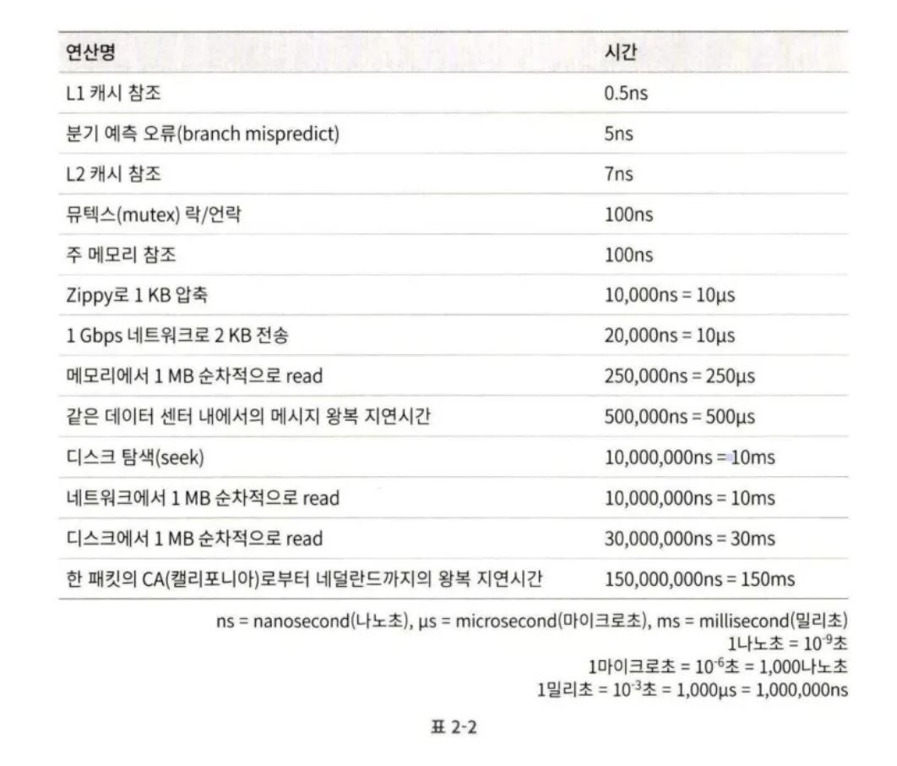
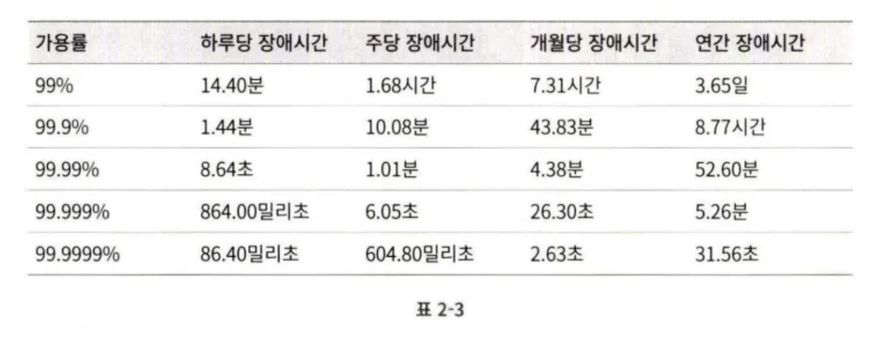

# 2장 개략적인 규모 추정

시스템 설계 면접을 볼 때, 때로은 시스템 용량이나 성능 요구사항을 개략적으로 추정해 보라는 요구를 할 수 있다.

개략적인 규모 추정은 보편적으로 통용되는 성능 수치 항목에서 사고 실험을 행하여 추정치를 계산하는 행위로서, 어떤 설계가 요구사항에 부합할 것인지 보기 위한 것이다.

개략적 규모 추정을 효과적으로 하기 위해선 규모 확장성을 표현하는 데 필요한 수치들에 대한 이해가 필요하다.

- 2의 제곱수
- 응답지연(latency) 값
- 가용성에 관계된 수치들

## 2의 제곱수

- 데이터 볼륨 단위를 계산하기 위해 사용한다.
- 최소단위는 1바이트(8비트) 이다.
- 아스키 문자 하나가 차지하는 메모리의 크기가 1바이트이고 보통 많이 사용되는 UTF-8의 경우 1~4 바이트가 사용된다.
- 한글 또는 다국어를 고려할 때 한 단어를 4바이트까지 고려하는 것이 좋겠다.
- 대략 많이 사용되는 기가바이트는 약 10억 으로 2의 30제곱이다.

## 모든 프로그래머가 알아야 하는 응답지연 값

2010년 통상적인 컴퓨터에서 구현된 연산들의 응답지연 값이다. 이 중 몇몇은 더 빠른 컴퓨터가 등장하면서 더 이상 유효하지 않게 되었지만, 아직도 해당 수치들은 컴퓨터 연산들의 처리 속도가 어느정도인지 짐작할 수 있게 한다.

**제시된 수치의 분석 결과**

- 메모리는 빠르지만 디스크는 아직도 느리다.
- 디스크 탐색은 가능한 한 피하라
- 단순 압축 알고리즘은 빠르므로 가능한 데이터를 네트워크로 전송하기 전에 압축하라 (gzip)
- 데이터 센터는 보통 여러 지역에 분산되어 있고 센터들 간에 데이터를 주고받는데는 시간이 걸린다.

## 가용성에 관계된 수치들

고가용성(high availability; HA)은 시스템이 오랜 시간 동안 지속적으로 중단 없이 운영될 수 있는 능력을 지칭하는 용어이다. 고가용성을 표현하는 값은 퍼센트로 표현하며, 100%는 시스템이 단 한 번도 중단된 적이 없었음을 의미한다.

SLA(Service Level Agreement)는 서비스 사업자(service provider)가 보편적으로 사용하는 용어로, 서비스 사업자와 고객 사이에 맺어진 합의를 의미한다. 해당 합의에는 서비스 사업자가 제공하는 서비스의 가용시간(uptime)이 공식적으로 기술되어 있다. 아마존, 구글, 그리고 마이크로소프트와 같은 사업자는 99% 이상의 SLA 를 제공한다.

가용 시간은 관습적으로 숫자 9를 사용해 표시하고 9가 많으면 많을수록 좋다고 보면 된다.

## 예제: 트위터 QPS와 저장소 요구량 추정

### 가정

- 월간 능동 사용자는 3억 명이다.
- 50%의 사용자가 트위터를 매일 사용한다.
- 평균적으로 각 사용자는 매일 2건의 트윗을 올린다.
- 미디어를 포함하는 트윗은 10% 정도다.
- 데이터는 5년간 보관된다.

### 추정

**QPS(Query Per Second) 추정치**

- 평균적으로 각 사용자는 매일 2건의 트윗을 올린다 ⇒ 일간 능동 사용자 = 3억 x 50% = 1.5억
- QPS = 1.5억 * 2 트윗 / 24시간 / 1분(3600초) = 약 3500
- 최대 QPS(Peek QPS) = 3500 * 2 = 약 7000
    - 추정되는 평균 QPS 에 곱을 최대 QPS 로 산정

미디어 저장을 위한 저장소 요구량

- 평균 트윗 크기(avg)
    - tweet_id 에 64바이트
    - 텍스트에 140바이트
    - 미디어에 1MB
- 미디어를 포함하는 트윗은 10% 정도다.
    - 1.5억 *2(개)* 10% * 1MB = 30TB/일
- 데이터는 5년간 보관된다.
    - 30TB x *365일 x* 5년 = 약 55PB

## 팁

개략적인 규모 추정과 관계된 면접에서 가장 중요한 것은 문제를 풀어 나가는 절차다. 올바른 절차를 밞느냐가 결과를 내는 것보다 중요하다. 즉, 여러분의 문제 해결 능력을 보여주어야 한다.

- 근사치를 사용한 계산을 할줄 알아야 한다.
    - 예시로 “99987/9.1” 를 계산하기 위해 시간을 쓰는 것은 낭비이다.
    - 계산 결과의 정확함을 평가하는 것이 아니다.
    - “100,000/10” 과 같은 적절한 근사치를 활용하여 계산 시간을 줄인다.
- 가정은 적어 둬라, 나중에 살펴볼 수 있도록
- 단위를 붙이는 습관을 둬라
    - 5만 적으면 5KB 인지 5MB인지 알 수 없다.
    - 꼼꼼함을 챙기는 개발자로 보이자.
- 많이 출제되는 개략적 규모 추정 문제는 QPS, 최대 QPS, 저장소 요구량, 캐시 요구량, 서버 수 등을 추정하는 것이다. 미리 계산하는 연습을 해두어라.