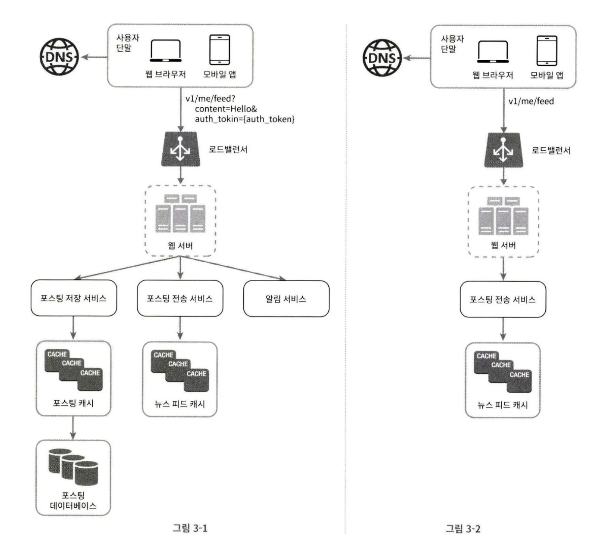

# 3장 시스템 설계 면접 공략법
## 시스템 설계 면접의 의도

시스템 설계에 대해 물어보는 이유가 무엇인가?

- 두 명의 동료가 모호한 문제를 풀기 위해 협력하여 그 해결책을 찾아내는 과정에 대한 시뮬레이션이다.
- 정해진 결말이나 정답이 없다.
- 설계 과정이 중요하다.
    - 설계 기술을 시연하는 자리이다.
    - 설계 과정에서 내린 결정들에 대한 방어 능력을 보인다.
    - 면접관이 주는 피드백을 건설적인 방식으로 처리할 자질을 보여주면 된다.

면접관 입장에서 시스템 설계를 통해 찾고자 하는 것은?

- 지원자의 설계 능력도 (물론 중요할 수 있지만) 그 이상이다.
- 지원자가 협력에 적합한 사람인지, 압박이 심한 상황을 잘 헤쳐나갈 수 있는지를 파악한다.
- 그리고 **좋은 질문을 던질 능력이 있는지도 중요하다.**

부정적 신호

- 과도한 엔지니어링
- 오버엔지니어링은 시스템 전반의 비용을 높이는 결과를 준다.
- 완고함
- 편협함

## 효과적 면접을 위한 4단계 접근법

시스템 설계 면접은 제각각이나 그 절차나 범위에는 공통적인 부분이 있다.

### 1단계. 문제 이해 및 설계 범위 확정

- 질문을 받고 생각 없이 빠르게 답을 내는 행위는 하지말라
    - 요구사항을 완전히 이해하지 않고 답을 내놓은 것은 부정적 신호이다.
    - 면접은 퀴즈 쇼가 아니며, 정답이 없다는 것을 상기해야 한다.
- **깊이 생각하고, 요구사항과 가정을 분명히 해야 한다.**
- **올바른 질문을 계속 던져라**
    - 즉, 질문을 통해 시스템 구축에 필요한 정보를 얻는 것이다.
- 어떤 질문을 해야 할까
    - 구체적으로 어떤 기능들을 만들어야 하나
    - 제품 사용자 수는 얼마나 되나
    - 회사의 규모는 얼마나 빨리 커지리라 예상하나
    - 회사가 주로 사용하는 기술 스택은 무엇인가? 설계를 단순화하기 위해 활용할 수 있는 기존 서비스로는 어떤 것이 있는가?

**예제**

주제: 뉴스 피드 시스템을 설계하라

우리는 요구사항을 분명히 하기 위해 다음 질문을 던저야 한다.

- 모바일 웹과 앱 중 어떤 것을 지원해야 하나요? 둘 다인가요?
- 가장 중요한 기능은 무엇인가요?
- 뉴스 피드의 정렬 기준은 무엇인가요?
    - 단순 시간 역순 정렬인가
    - 가까운 친구인 경우 가중치가 부여되어야 하는가
- 한 사용자는 최대 몇 명의 사용자와 친구를 맺을 수 있나요?
- 사이트로 오는 트래픽 규모는 어느정도인가요?
- 피드는 이미지나 비디오와 같은 미디어 파일도 올라올 수 있나요?

___

### 2단계 개략적인 설계안 제시 및 동의 구하기

개략적인 설계안을 제시한 다음 면접관의 동의를 얻는다. 이 과정은 면접관과 협력하여 진행하면 좋다.

- 설계안에 대한 최초 청사진을 제시하고 의견을 구하라
    - 면접관을 마치 팀원인 것처럼 생각하고 묻는 것이 좋다.
    - 좋은 면접관들은 지원자와 대화하고 설계 과정을 같이 하기를 좋아한다.
- 화이트보드/종이에 핵심 컴포넌트를 포함하는 다이어그램을 그려라
    - 클라이언트(모바일/웹),API, 웹 서버, 데이터 저장소, 캐시, CDN, 메시지 큐 등의 컴포넌트
- 최소 설계안이 시스템 규모에 관계된 제약사항을 만족하는지 대략 계산해본다.
    - 계산 과정은 소리 내어 설명해라
    - 아울러서 이런 개략적 추정이 필요한지는 면접관에게 미리 물어보자

실제 시스템의 구체적 사용 사례를 몇 가지 살펴보면 개략적 설계안을 잡는데 도움이 된다. 고려하지 못한 에지 케이스를 발견하는 데도 도움이 될 수 있다.

이 단계에서 API 엔드 포인트나 DB 스키마와 같은 구체적 사항도 보여야 하는지는 면접 질문에 달라진다. 만약, 질문이 “구글 검색 엔진을 설계하라” 와 같은 큰 규모라면 DB 스키마 같은 것은 지나치게 세부적인 내용일 것이다. 하지만 “특정 기능의 백엔드 서버를 설계하라” 와 같은 질문은 이러한 세부적인 내용이 괜찮을 수 있다. 이런 것은 면접관에 질문하는 것이 낫다.

**예제**

뉴스 피드 설계 예시를 들어 설명한다.

개략적으로 보면 이 설계는 두 가지 처리 플로우로 나눠 생각할 수 있다.

- 피드 발행: 사용자가 포스트를 올리면 관련 데이터가 캐시/DB 에 기록되고, 해당 사용자의 친구의 뉴스 피드에 포스트가 뜨게 된다.
- 피드 생성: 어떤 사용자의 뉴스 피드는 해당 사용자 친구들의 포스트를 시간 역순으로 정렬하여 만든다.

___

### 3단계 상세 설계

이 단계로 온 경우엔 면접관과 다음 목표는 달성한 상태일 것이다.

- 시스템에서 전반적으로 달성해야 할 목표와 기능 범위 확인
- 전체 설계의 개략적 청사진(구상/계획) 마련
- 해당 청사진에 대한 면접관의 의견 청취
- 상세 설계에서 집중해야 할 영역 확인

이제 해야 하는 것은 설계 대상 컴포넌트 사이의 우선순위를 정하는 것이다. 즉, 어떤 것에 집중할 것이냐

- 선임급 개발자라면
    - 시스템의 성능 특성에 대한 질문
    - 시스템의 병목 구간이나 자원 요구량 추정치에 초점이 맞춰진다.
- 하지만, 대부분 경우 특정 시스템 컴포넌트들의 세부사항을 깊이 있게 설명하는 것을 본다.
    - 가령, 단축 URL 생성기를 만든다면 그 해시 함수의 설계를 구체적으로 설명
    - 채팅 시스템이라면 어떻게 latency 을 줄이고, 온/오프라인 상태를 표시할 수 있을까
- 하지만, 너무 사소하고 불필요한 세부사항을 설명하다보면 시간 관리가 안될 수 있다.
    - ex. 뉴스 피드의 순위를 매기는 데 사용된 특정 알고리즘에 대한 깊은 설명은 불필요하다.
    - 시스템 설계는 규모에 따라 확장 가능한 시스템을 설계할 능력에 대해 보는 것이다.
    

**예제**

개략적 설계를 마친 후 이제 두 가지 주요 사항을 더 깊이 탐구해야 한다.

- 피드 발행
- 뉴스 피드 가져오기

___

### 4단계 마무리

면접관은 설계 결과물에 대한 후속 질문을 던질 수도 있으며, 지원자 스스로가 추가 논의를 진행하도록 할 수도 있다. 다음의 몇 가지 지침을 활용하도록 하자

- 면접관이 시스템 병목 구간, 혹은 더 개선 가능한 지점을 찾아내라고 할 수 있다.
    - 여기서 우리의 설계가 완벽하다거나 개선점이 없다고 말해선 안된다.
    - 개선할 점은 언제나 존재한다.
    - 이러한 질문은 비관적 사고 능력을 보이고, 마지막으로 좋은 인상을 남길 수 있는 기회이다.
- 만든 설계를 다시 한번 요약해서 보여주는 것이 도움이 될 수 있다.
- 오류가 발생하면 무슨 일이 생기는지(서버 오류, 네트워크 장애 등) 따져보면 흥미로울 것이다.
- 운영 이슈도 논의할 수 있다.
    - 매트릭은 어떻게 수집하고 모니터링할 것인가?
    - 시스템은 어떻게 배포해 나갈 것인가?
- 미래의 규모 확장 요구에 어떻게 대처할 것인지
    - 현재 설계는 100만 사용자를 수용한다면, 천만 규모가 된다면 어떻게 해야 하는가?
- 시간이 좀 남는다면, 필요하지만 다루지 못했던 세부적 개선사항을 제안할 수 있다.

## 해야할 것 vs 하지 말아야 할 것

**해야할 것**

- 질문을 통해 애매하거나 모르는 것은 계속 확인하라
    - 확신이 없는데 스스로 내린 가정이 옳다고 믿고 진행하면 안된다.
- 문제의 요구사항을 이해하라
- 정답이나 최선의 답안은 없다는 것을 명심하라
    - 스타트업을 위한 설계안과 중견 기업을 위한 설계안을 같을 수 없다.
    - 요구사항을 정확히 이해했는지 다시 확인하라
- 면접관과 소통하면서 면접관이 우리의 사고 흐름을 잘 이해할 수 있도록 하라
- 가능하다면 여러 해법을 함께 제시하라
- 개략적 설계에 면접관의 동의를 얻었다면, 각 컴포넌트의 세부사항을 설명하라
    - 가장 중요한 컴포넌트부터 설명을 시작하라
- 면접관의 아이디어를 이끌어 내라 (같은 팀원처럼 협력한다.)
- 포기하지 말아라

**하지 말아야 할 것**

- 전형적인 면접 문제들에도 대비하지 않은 상태에선 면접장에 가지 마라
- 요구사항이나 가정을 분명히 하지 않은 상태에서 설계를 빨리 제시하려고 하지마라
- 처음부터 특정 컴포넌트의 세부사항을 너무 깊이 설명하지 말라
    - 먼저, 개략적 설계 후에 세부사항 설명으로 나아가라
- 진행 중에 막혔다면, 힌트를 청하기를 주저하지 말라. 질문해라
- 소통을 주저하지 말라. 침묵 속에 설계하지 마라
- 설계안을 내놓는 순간 면접이 끝났다고 생각하지 마라

## 시간 배분

- 시스템 설계 면접은 매우 광범위한 영역을 다루므로 한 시간이 충분하지 않을 수 있다.
- 따라서 시간 관리가 중요하다.
- 각 단계에 어느 정도의 시간 배분이 좋을까? (실제론 그때의 면접관과 상황에 따라 다를 수 있다.)
    - 만약, 45분의 면접 시간이 있다고 해보자.
    - 1단계 - 문제 이해 및 설계 범위 확정: 3~10분
    - 2단계 - 개략적 설계안 제시 및 동의 구하기: 10~15분
    - 3단계 - 상세 설계: 10~25분
    - 4단계 - 마무리: 3~5분
- 대략, 개략적 설계 < 상세 설계 쪽에 시간을 많이 투자할 수 있도록 한다.