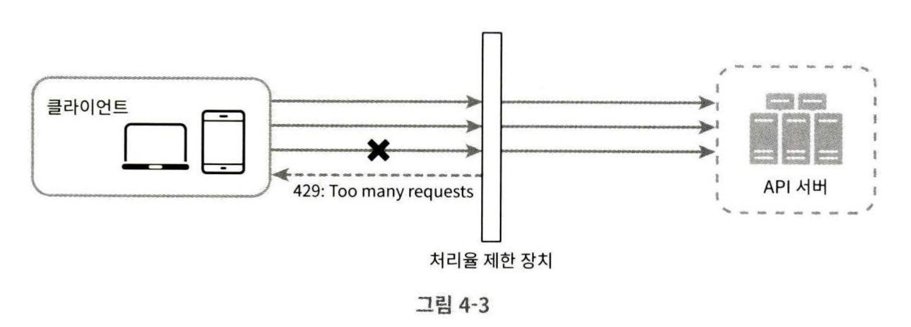
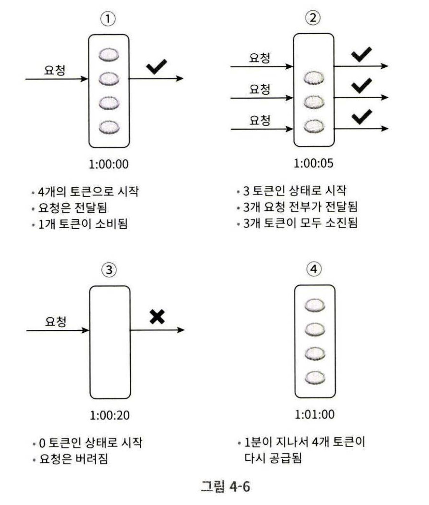
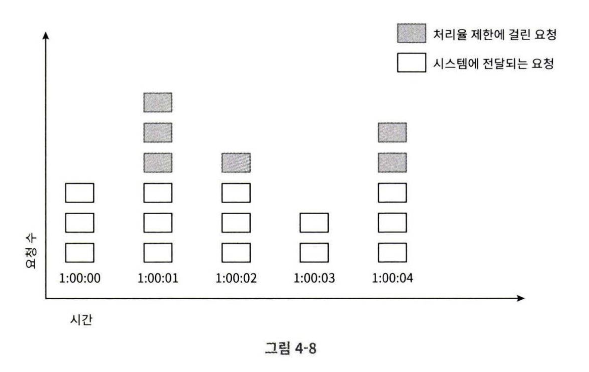
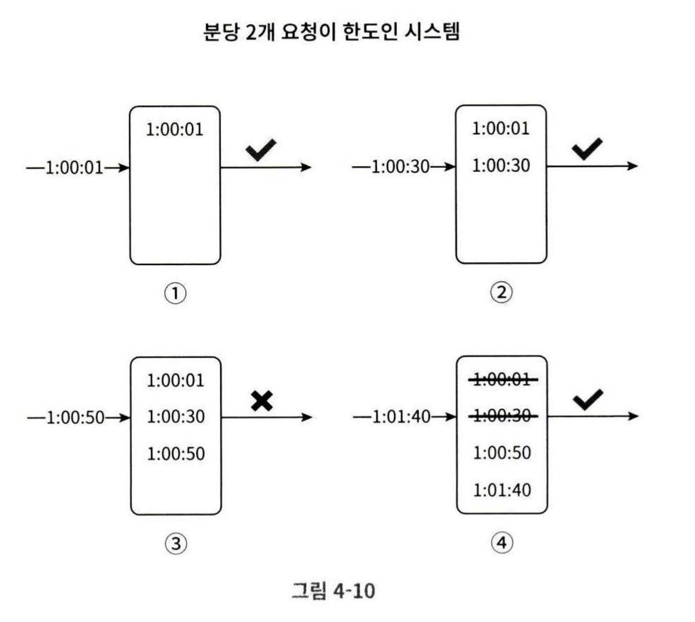
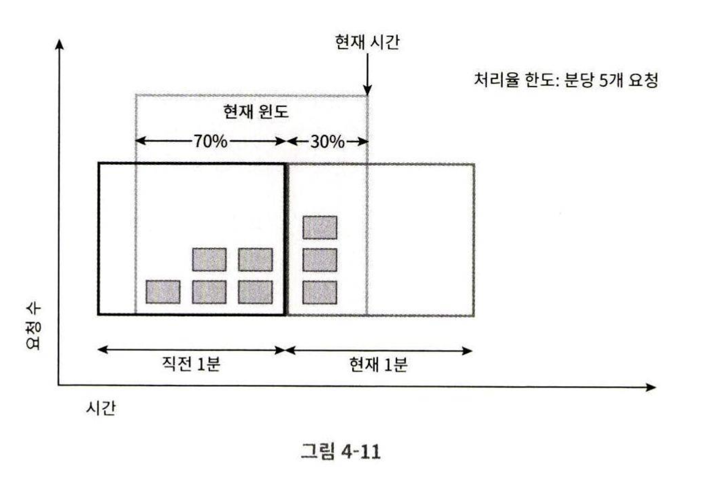
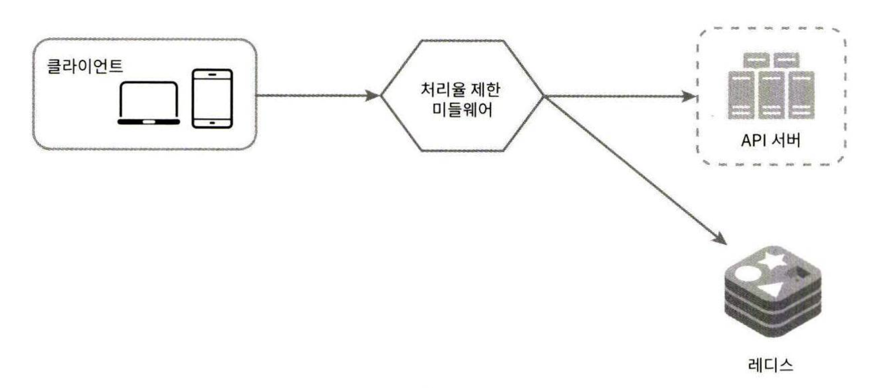
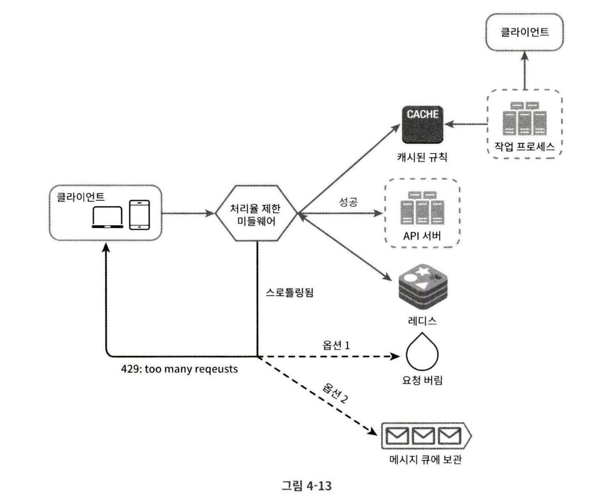

# 4장 처리율 제한 장치의 설계

## 처리율 제한 장치란?

- 네트워크 시스템에서 처리율 제한 장치(rate limiter)는 클라이언트 또는 서비스가 보내는 트래픽의 처리율(rate)을 제어하기 위한 장치다.
- HTTP 를 예로 들면 특정 기간 내에 전송되는 클라이언트의 요청 횟수를 제한하는 장치이다.
- API 요청 횟수가 제한 횟수가 제한 장치에 정의된 임계치(threshold)를 넘어서면 추가로 도달한 모든 호출은 처리가 중단(block)된다.
- 사용 사례
    - 사용자는 초당 2회 이상 새 글을 올릴 수 없다.
    - 같은 IP 주소로는 하루에 10개 이상의 계정을 생성할 수 없다.
    - 같은 디바이스로는 주당 5회 이상 리워드를 요청할 수 없다.

## 처리율 제한 장치를 왜 둘까?
API 에 이 장치를 두었을 때 좋은 점이 무엇일까

- **DoS 공격에 의한 자원 고갈을 방지한다.**
    - 대형 IT 기업들의 대부분의 공개 API는 처리율 제한 장치를 가지고 있다.
    - 예시
        - 트위터는 3시간 동안 300개의 트윗만 올릴 수 있도록 제한한다.
        - Google Docs API 는 사용자당 분당 300회의 read 요청만 허용한다.
- **비용 절감**
    - 추가 요청에 대한 처리를 제한해버리면 서버 비용이 절감된다.
    - 즉, 서버를 많이 두지 않아도 되고 우선순위가 높은 API 에 더 많은 자원을 할당할 수 있다.
    - 또한 제3자(써드 파티) API 에 사용료를 지불하고 있는 회사들에게 더욱 이 장치는 중요하다.
        - 신용 확인, 카드 결제, 건강 상태 확인 등 외부 호출 API 에 대한 과금을 줄일 수 있다.
- **서버 과부하를 막는다.**
    - 봇에서 오는 트래픽이나 사용자의 잘못된 이용 패턴으로 유발되는 트래픽을 걸러낸다.

## 1단계 문제 이해 및 설계 범위 확정

- 처리율 제한 장치를 구현하는 데는 여러 알고리즘을 사용할 수 있고, 각각 장단점을 가지고 있다.
- 어떤 알고리즘이 적합한지를 알아봐야 한다.

**어떤 장치인가**

- 클라이언트 측 제한 장치인가, 서버 측 제한 장치인가 → 서버측 API 를 위한 제한 장치
- 어떤 기준으로 API 호출을 하는가 (IP 주소, 사용자 ID 등) → 다양한 형태의 제어 규직을 정의할 수 있는 유연한 시스템
- 시스템 규모 (스타트업 vs 대기업) → 대규모 요청을 처리해야 한다.
- 시스템이 분산 환경에서 동작해야 하는가? → 그렇다.
- 독립된 서비스인가 애플리케이션 코드에 포함될 수 있는가 → 본인 선택
- 사용자에게 걸러진 사실을 알려야 하는가 → 그렇다.

**요구사항 정리**

- 설정된 처리율을 초과하는 요청은 정확하게 제한한다.
- 낮은 응답시간(지연시간): 이 장치가 HTTP 응답에 나쁜 영향을 주면 안된다.
- 가능한 한 적은 메모리를 써야 한다.
- 분산형 처리율 제한
    - 하나의 처리율 제한 장치를 여러 서버나 프로세스에서 공유할 수 있어야 한다.
- 예외 처리: 요청이 제한되었을 땐 그 사실을 사용자에게 알려야 한다.
- 높은 결함 감내성(fault tolerance): 장치에 장애가 생겨도 전체 시스템에 영향을 주면 안된다.

## 2단계 개략적 설계안 제시 및 동의 구하기

너무 복잡하게 생각하지 말고 기본 클라이언트-서버 통신 모델을 사용해보자

**처리율 제한 장치는 어디에 둘 것인가**

- 클라이언트 측에 두는 경우
    - 일반적으로는 클라이언트는 처리율 제한을 안정적으로 걸 수 있는 장소가 못 된다.
    - 클라이언트 요청은 쉽게 위변조가 가능하기 때문
    - 모든 클라이언트의 구현을 통제하는 것도 어려울 수 있다.
- 서버 측에 두는 경우
    - API 서버에 장치를 같이 두는 방법
    
    - 처리율 제한 미들웨어(middleware)를 만들어 미들웨어로 API 서버로 가는 요청을 통제하는 방법
    
    - API 처리율이 초당 2개로 제한되었다면, 클라이언트가 3번째 요청을 할 때 미들웨어에 의해 가로막힌다.
    - 이때 클라이언트로는 HTTP 상태 코드 429가 반환된다.
    - HTTP 429 상태 코드는 사용자가 너무 많이 요청을 보낸다(Too many requests)는 사실을 알린다.

**보통 어디에 구현되는가**

- 폭넓게 채택된 기술인 클라우드 마이크로서비스(즉, 클라우드 + MSA) 구조에선 API 게이트웨이에 구현된다.
- **API 게이트웨이(gateway)**
    - 처리율 제한, SSL 종단, 사용자 인증, IP 허용 목록 관리 등을 지원하는 완전 위탁관리형 서비스
    - 즉, 클라우드 업체가 유지 보수를 담당하는 서비스다.
    - API 게이트웨이는 처리율 제한을 지원하는 미들웨어 역할을 한다.

**처리율 제한 기능을 설계할 때 고려해야 하는 것**

- 현재 사용하고 있는 기술 스택
    - 프로그래밍 언어, 캐시 서비스 등
    - 현재 사용하는 프로그래밍 언어가 서버 측 구현을 하기에 충분할 정도로 효율이 높은지 확인해라
- 필요에 맞는 처리율 제한 알고리즘 찾기
    - 서버 측에서 모든 것을 구현한다면 알고리즘 선택은 자유롭다.
    - 단, 제3 사업자가 제공하는 게이트웨이를 사용한다면 선택지는 제한될 수 있다.
- 만약, 설계가 MSA 에 기반하고 있으며, API 게이트웨이가 이미 설계에 포함되어 있다면 처리율 제한 기능 또한 게이트웨이에 포함시켜야 할 수 있다.
- 처리율 제한 장치를 직접 구현하는 게 맞는가?
    - 다 시간과 비용이다.
    - 충분한 인력이 없다면 상용 API 게이트웨이를 쓰는 것이 바람직할 것이다.

---

### 처리율 제한 알고리즘

널린 알려진 인기 알고리즘으론 다음이 있고, 각각 장단점을 가지고 있다.

- 토큰 버킷(token bucket)
- 누출 버킷(leaky bucket)
- 고정 윈도 카운터(fixed window counter)
- 이동 윈도 로깅(sliding window log)
- 이동 윈도 카운터(sliding window counter)

___

`토큰 버킷 알고리즘`

- 토큰 버킷 알고리즘은 처리율 제한에 폭넓게 이용되고 있다.
- 간단하고, 알고리즘에 대한 세간의 이해도도 높은 편이고 인터넷 기업들이 보편적으로 사용한다.
- 아마존과 스트라이프가 API 요청 통제를 위해 이 알고리즘을 사용한다.

**동작 원리**

- 토큰 버킷은 지정된 용량을 갖는 컨테이너로, 사전 설정된 양의 토큰이 주기적으로 채워진다.
    - 토큰 공급기(refiller): 토큰을 일정된 시간동안 설정된 양으로 채워넣는 역할을 한다.
    - 버킷에 토큰이 추가될 때 꽉차있다면 더 이상의 토큰은 추가되지 않는다. 버려진다.(overlfow)
- 요청이 들어온 경우 버킷에 토큰이 있는지 확인하고, 있다면 하나의 토큰을 사용한다.
    - 충분한 토큰이 없는 경우엔 해당 요청은 버려진다.(dropped)
    - 이때 토큰 공급기로부터 몇분(초) 뒤 다시 토큰이 채워지면 요청이 다시 처리될 수 있다.


**정리**

- 토큰 버킷 알고리즘은 2개 인자를 필요로 한다.
    - 토큰 공급률(refill rate): 초당 몇개의 토큰이 버킷에 공급되는가
    - 버킷 크기: 버킷에 담을 수 있는 토큰의 최대 개수
- 버킷은 몇 개를 사용해야 하는가
    - 공급 제한 규칙에 따라 달라질 수 있다.
    - 통상적으로는 API 엔드포인트마다 별도의 버킷을 둔다.
    - IP 주소 별로 제한을 적용해야 한다면 IP 주소마다 버킷을 하나씩 할당해야 한다.
    - 시스템의 처리율을 초당 10,000개로 제한한다면, 모든 요청이 하나의 버킷을 공유해야 한다.
- 장점
    - 구현이 쉽다.
    - 메모리 사용 측면에서도 효율적이다.
    - 짧은 시간에 집중되는 트래픽도 처리 가능하다. 버킷에 토큰만 있다면 요청은 시스템에 전달될 것이다.
- 단점
    - 버킷 크기와 토큰 공급률이라는 2개의 인자 값을 적절하게 튜닝하는 것이 까다롭다.

___

`누출 버킷 알고리즘`

- 토큰 버킷 알고리즘과 비슷하지만 요청 처리율이 고정되어 있다는 점이 다르다.
- 누출 버킷 알고리즘은 보통 FIFO 큐로 구현한다.
    - 큐에는 처리될 항목(요청)들이 보관된다.
- 전자상거래 기업인 쇼피파이(shopify)가 이 알고리즘을 사용하여 처리율 제한을 구현하고 있다.

**동작 원리**

- 요청이 도착하면 큐가 가득 차 있는지 확인한다. 빈자리가 있으면 큐에 요청을 추가한다.
- 큐가 가득 차 있다면 새 요청은 버린다.
- 지정된 시간마다 큐에서 요청을 꺼내어 처리한다.
    - 지정된 시간이므로 고정 속도로 처리된다. (요청 처리율이 고정됨)

**정리**

- 알고리즘은 2개의 인자가 필요하다.
    - 버킷 크기: 큐 사이즈와 같은 값이다.
    - 처리율(outflow rate): 지정된 시간당 몇 개의 항목을 처리할 지. 보통 초 단위로 표현된다.
- 장점
    - 큐의 크기가 제한되므로 메모리 사용량 측면에서 효율적이다.
    - 고정된 처리율을 가지고 있어 안정적 출력(stable outflow rate)이 필요한 경우에 적합하다.
- 단점
    - 단시간에 많은 트래픽이 몰리면 큐에 오래된 요청이 쌓이고, 요청을 제때 처리하지 못하여 최신 요청들이 버려지게 된다.
    - 2개 인자를 올바르게 튜닝하기까 까다로울 수 있다.

___

`고정 윈도 카운터 알고리즘`

**동작 원리**

- 타임라인을 고정된 간격의 윈도로 나누고, 각 윈도마다 counter 를 붙인다.
- 요청이 접수될 때마다 counter 의 값은 1씩 증가한다.
- counter 값이 사전에 설정된 임계치에 도달하면 새 요청은 새 윈도가 열릴 때까지 버려진다.
- 아래에선 타임라인의 단위가 1초가 되며, 초당 3개까지 허용된다. (임계치 = 3)
    
    
    

**정리**

- 문제점
    - 윈도의 경계 부근에 순간 많은 트래픽이 집중되면 할당된 양보다 더 많은 요청이 처리될 수 있다는 점이다.    
    - ex. 어떤 시스템이 분당 최대 5개의 요청만을 허용한다고 해놓았을 때
    - 2:00 ~ 2:01 사이 5개의 요청이 들어오고 2:01 ~ 2:02 사이에 또 5개의 요청이 들어왔다. (정상)
    - 하지만, 이를 경계 부근에서 1분을 관찰한다면 시스템이 분당 처리한 요청이 10개가 되는 것이다.
    - 즉, 허용 한도의 2배를 처리하게 되는 것이다.
- 장점
    - 메모리 효율이 좋다.
    - 이해하기 쉽다.
    - 윈도가 닫히는 시점에 카운터를 초기화하는 방식은 특정한 트래픽 패턴을 처리하기에 적합하다.
- 단점
    - 윈도 경계 부근에서 일시적으로 트래픽이 집중되는 경우, 처리 한도보다 많은 양의 요청을 처리하게 된다.

___


`이동 윈도 로깅 알고리즘`

- 앞선 고정 윈도 카운터 알고리즘에서의 중대한 문제점은?
    - 경계 부근에 트래픽이 몰리면 시스템에 설정한 한도보다 많은 요청을 처리하게 된다는 것
- 이동 윈도 로깅 알고리즘은 고정 윈도 카운터 알고리즘의 문제를 해결한다.

**동작 원리**

- 요청의 타임스탬프를 추적한다.
    - 보통 이 타임스탬프 데이터는 redis 의 sorted set 같은 캐시에 보관한다.
- 새 요청이 오면 만료된 타임스탬프는 제거한다.
    - 만료된 타임스탬프란? 그 값이 현재 윈도의 시작 시점보다 오래된 타임스탬프를 말한다.
- 새 요청의 타임스탬프를 로그에 추가한다.
- 로그의 크기가 허용치보다 같거나 작으면 시스템에 전달한다. 그렇지 않으면 처리를 거부한다.



- 예제는 분당 2개 요청이 한도인 시스템일 때
- 1:00 ~ 1:01 사이에 3개의 요청이 로그에 추가된다.
    - 하지만, 3번째 요청에서 로그의 크기가 3이 되어 허용 한도인 2를 초과한다.
    - 따라서 2번째까지만 요청이 전달되고, 로그는 남지만 3번째는 시스템에 요청이 전달되지 않는다.
- 이후 1:01:40 에 요청이 도착
    - 현 시점 기준으로 1분 내 범위인 [1:00:40, 1:01:40) 안에 있는 타임스탬프를 제외하고 모두 만료된다.
    - 만료된 타임스탬프 삭제 후 로그의 크기는 2이므로 1:01:40 의 신규 요청은 시스템에 전달된다.

**정리**

- 장점
    - 이 알고리즘이 구현하는 처리율 제한 알고리즘은 매우 정교하다.
    - 어느 순간의 윈도를 보더라도, 허용되는 요청의 개수는 시스템의 처리 한도를 넘지 않는다.
- 단점
    - 거부된 요청의 타임스탬프도 보관하게 되므로 다량의 메모리를 사용한다.

`이동 윈도 카운터 알고리즘`

- 고정 윈도 카운터 알고리즘과 이동 윈도 로깅 알고리즘을 결합한 것이다.
- 구현에는 두 가지 접근법이 있다. (여기선 하나만 설명)

**동작 원리**

- 아래 예제에서 처리율 제한 장치의 한도가 분당 7개로 설정되어 있다고 하자.
- 직전 1분 동안 5개 요청이 있었고, 현재 1분 동안 3개의 요청이 들어왔다.
- 현재 1분의 30% 시점에 도착한 새 요청의 경우, 현재 몇 개의 요청이 들어와 있다고 판단해야 할까
    - **현재 1분간의 요청 수 + 직전 1분간의 요청 수 x 이동 윈도와 직전 1분이 겹치는 비율**
    - 즉, 여기선 3 + (5 x 0.7) = 6.5 개이다.
    - 반올림 또는 내림할 수 있으나, 본 예제에선 내림을 채택하여 6으로 쓴다.
- 한도가 7개로 설정되어 있으므로 현재 1분의 30% 시점에 도착한 새 요청은 시스템이 전달된다.
- 하지만, 그 직후엔 한도에 도달했으므로 더 이상의 요청은 받을 수 없다.



**정리**

- 장점
    - 전 시간대의 평균 처리율에 따라 현 윈도 상태를 계산하므로 짧은 시간에 몰리는 트래픽에도 잘 대응한다.
    - 메모리 효율이 좋다.
- 단점
    - 직전 시간대에 도착한 요청이 균등하게 분포되어 있다고 가정한 상태에서 추정치를 계산하므로 다소 느슨하다. 하지만 이 문제는 심각한 문제는 아니다. 클라우드플레어가 실시한 실험에 따르면 40억 개의 요청 가운데 시스템의 실제 상태와 맞기 않게 허용되거나 버려진 요청은 0.003% 에 불과했다.
    
---

### 개략적인 아키텍처

- 처리율 제한 알고리즘의 기본 아이디어는 단순하다.
    - 얼마나 많은 요청이 접수되었는지 추적할 수 있는 카운터를 대상별로 둔다.
    - 카운터 값이 특정 한도를 넘어서면 이후 요청은 거부하는 것이다.
- 카운터를 어디에 보관하는 것이 좋을까
    - DB 는 디스크 접근때문에 느리고 성능 저하가 있으므로 안된다.
    - 메모리 상 동작하는 캐시가 바람직하다. 빠르고 시간에 기반한 만료 정책을 지원하기 때문이다.
    - Redis 는 처리율 제한 장치를 구현할 때 자주 사용되며, 두 명령어를 사용한다.
        - INCR: 메모리에 저장된 카운터 값을 1씩 증가시킨다.
        - EXPIRE: 카운터에 ttl 을 지정한다.
    



**동작 원리**

- 클라이언트가 처리율 제한 미들웨어에게 요청을 보낸다.
- 미들웨어는 redis 의 지정 버킷에서 카운터를 가져와서 한도에 도달했는지 확인한다.
    - 한도에 도달했다면 요청은 거부된다.
    - 한도에 도달하지 않았다면 API 서버로 요청이 전달된다.
    - 이때, 미들웨어는 카운터 값을 증가시킨 후 다시 레디스에 저장해야 한다.

## 3단계 상세 설계
앞선 개략적 설계에선 다음 사항은 알 수 없다.
- 처리율 제한 규칙은 어떻게 만들어지고 어디에 저장되는가
- 처리가 제한된 요청들은 어떻게 처리되는가

즉, 처리율 제한 규칙을 어떻게 세우고 관리하며, 거부된 요청 처리 전략을 세워야 한다.


### 처리율 제한 규칙 
리프트(Lyft) 기업은 처리율 제한에 오픈소스를 사용한다. 
아래를 보고 어떤 처리율 제한 규칙이 사용되고 있는지 알 수 있다.
```
domain: messaging
descriptors:
    - key: message.type
      Value: marketing
      rate_limit:
        unit: day
        requests_per_unit: 5
```
위는 시스템이 처리할 수 있는 마케팅 메시지의 최대치를 하루 5개로 제한하고 있다.

```
domain: auth
descriptors:
    - key: auth_type
      Value: login
      rate_limit:
        unit: minute
        requests_per_unit: 5
```
위는 클라이언트가 분당 5회 이상 로그인 요청을 할 수 없도록 제한한다. <br>
이런 규칙은 보통 **설정 파일(configuration file) 형태로 디스크에 저장된다.**

___

### 처리율 한도 초과 트래픽의 처리
- 만약, 어떤 요청이 한도 제한에 걸렸다면 HTTP 429 응답을 클라이언트에게 보낸다.
- 경우에 따라서는 한도 제한에 걸린 메시지를 나중 처리하기 위해 큐에 보관해놓을 수도 있다.
    - 만약, 어떤 주문이 시스템 과부하로 인해 한도 제한에 걸렸다면?
    - 해당 주문들은 보관했다가 나중에 처리할 수도 있을 것이다.

**처리율 제한 장치가 사용하는 HTTP 헤더**
- 클라이언트는 자기 요청이 처리율 제한에 걸리는지, 걸리기까지는 얼마나 많은 요청을 보낼 수 있는지 어떻게 알까
- 그 정답은 HTTP 응답 헤더를 보면 알 수 있다.
- 이번에 설계하는 처리율 제한 장치는 다음의 HTTP 헤더를 클라이언트에게 보낸다.  
    - X-Ratelimit-Remaining: 윈도 내에 남은 처리 가능 요청의 수
    - X-Ratelimit-Limit: 매 윈도마다 클라이언트가 전송할 수 있는 요청의 수
    - X-Ratelimit-Retry-After: 제한에 걸리지 않으려면 몇 초 뒤에 요청을 다시 보내면 되는가
- 사용자가 너무 많은 요청을 보내면 429 오류 상태를 X-Ratelimit-Retry-After 헤더와 같이 반환하여 알린다.

### 상세 설계
상세 설계한 도면을 가지고 동작 과정을 살펴보자

- 처리율 제한 규칙 관리
    - 디스크에 보관한다.
    - worker 프로세스는 수시로 규칙을 디스크에 읽어 캐시에 저장한다.
- 클라이언트가 요청을 서버에 보내면 요청은 먼저 처리율 제한 미들웨어에 도달한다.
- 미들웨어는 제한 규칙을 캐시에서 가져오고, 카운터 및 마지막 요청의 타임스탬프를 redis 에서 가져와서 판단한다.
    - 해당 요청이 처리율 제한에 걸리지 않으면 API 서버로 요청을 전달한다.
    - 해당 요청이 처리율 제한에 걸리면 429 에러를 클라이언트에게 보낸다.
    - 경우에 따라서는 해당 요청이 그대로 버려질수도, 메시지 큐에 보관하여 나중 처리될 수도 있다.


___

### 분산 환경에서의 처리율 제한 장치의 구현
- 단일 서버 내에서 처리율 제한 장치보다 여러 대 서버가 있는 분산 환경의 경우 어렵다.
- 여러 서버에서 병렬 스레드 작업이 지원되려면? 두 가지 문제 해결이 필요하다.
    - 경쟁 조건 (race condition)
    - 동기화 (synchronization)

`경쟁 조건`
- 처리율 제한 장치의 동작은 카운터 값 증가를 통해 한도를 넘었는지 확인하는 것이었다.
- 동작
    - redis 에서 카운터 값을 가져온다.
    - counter + 1 값이 임계치를 넘는지를 본다.
    - 넘지 않으면 redis 에 counter + 1 값으로 다시 저장한다.
- 이때 만약 경쟁 조건이 일어난다면?
    - 두 서버에서 거의 동시에 redis 에서 카운터 값을 가져온다. (counter = 3)
    - 따라서 두 요청 모두 결과가 counter + 1 된 4 가 되어 잘못된 결과가 나온다. (의도는 5가 되어야 알맞다.)
    - **따라서 잘못된 경우 한도 제한이 넘은 사용자의 요청이 거부되지 않고 처리될 수 있다.**
- race condition 의 흔한 해결책은 락(lock)이다.
    - 하지만, 락은 시스템 성능을 떨어트릴 수 있는 문제가 있다.
    - 위의 경우엔 락 대신 두 가지 방법으로 해결할 수 있다.
        - lua script 를 사용하여 원자적으로 수행하도록 함
        - 정렬 집합 (sorted set) 자료 구조 사용

`동기화 이슈`
- 동기화는 분산 환경에서 반드시 고려할 문제이다.
- 규모가 커져 여러 서버로 확장되었다면, 처리율 제한 장치 서버도 한 대로 충분하지 않고 여러 대로 두어야 한다. 
- 만약, 장치 서버가 여러 대가 되면 서버들 간의 동기화가 필요하다. 동일 클라이언트에 대한 같은 상태 유지를 위해
    - 클라이언트1의 요청이 처리율 제한 장치1로 보내졌다가 장치2로 가게 된다면?
    - 하지만, 고정 세션을 활용해서 무조건 같은 클라이언트 요청은 하나의 장치로만 보내도록 하면 되지 않나
    - 이 방법은 규모면에서 확장 가능하지도 않고 유연하지 않으므로 추천되는 해결책이 아니다.
- 해결책
    - 레디스와 같은 중앙 집중형 데이터 저장소를 사용하는 것
    - 레디스에서 상태 관리

___

### 성능 최적화
- 앞서 본 설계에선 두 가지의 개선이 가능하다.
- 첫째, 여러 데이터센터 지원
    - 특정 지점의 데이터센터에서 멀리 떨어진 사용자를 지원하려다 보면 latency 가 늘어날 수 밖에 없다.
    - 대부분 클라우드 제공 업체는 세계 곳곳에 에지 서버(edge server)를 심어놓는다.
    - 사용자의 요청이 들어오면 그 트래픽을 가장 가까운 에지 서버로 전달하여 latency 를 줄일 수 있다.
- 둘째, 제한 장치 간 동기화 시 최종 일관성 모델을 사용하는 것
    - 일관성 모델은 6장의 "데이터 일관성" 항목을 참고

___

### 모니터링
- 기본적으로 모니터링을 통해 알고 싶은 것은 다음 두 가지이다.
    - 채택된 처리율 제한 알고리즘이 효과적이다. 
    - 정의한 처리율 제한 규칙이 효과적이다.
- 만약, 처리율 제한 규칙이 너무 빡빡하게 설정되었다면?
    - 많은 유효 요청이 처리되지 못하고 버려진다. 따라서 완화할 필요가 있다.
- 만약, 일시적으로 트래픽이 급증할 때 장치가 비효율적으로 동작한다면?
    - ex. 깜짝 세일 이벤트
    - 이때의 트래픽 패턴을 잘 처리할 수 있도록 알고리즘을 변경하는 것을 고려해볼 수 있다.
    - 이 경우엔 토큰 버킷 알고리즘이 적합하다. (버킷에 토큰만 있으면 처리되므로 트래픽 감당이 쉽다.)

## 4단계 마무리
앞서 알고리즘이나 분산 환경에서의 설계, 성능 최적화 등 이외도 여유만 있다면 고려해볼 것들이 있다.
- 경성(hard) 또는 연성(soft) 처리율 제한
    - 경성 처리율 제한: 요청의 개수는 절대 임계치를 넘을 수 없음
    - 연성 처리율 제한: 요청 개수는 일시적으로는 임계치를 넘어설 수 있음
- 다양한 계층에서의 처리율 제한
    - 애플리케이션 계층 외에도 iptables 를 사용하면 ip 주소로 제한을 적용할 수도 있다.
- 처리율 제한 회피 방법, 클라이언트를 어떻게 설계하는 것이 최선인가
    - 클라이언트 측 캐시를 사용하여 API 호출 횟수를 줄인다.
    - 처리율 제한 임계치를 이해하고, 짧은 시간 동안 너무 많은 메시지를 보내지 않도록 한다.
    - 예외나 에러 처리 코드를 도입하여 클라가 예외적 상황을 우아하게 복구할 수 있도록 한다.
    - 재시도 로직 구현 시엔 충분한 백오프 시간을 둔다.


