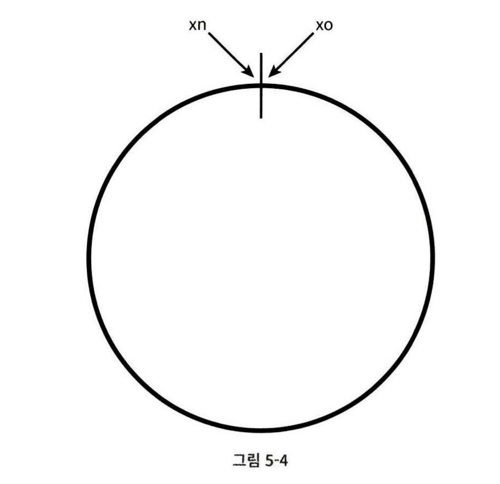
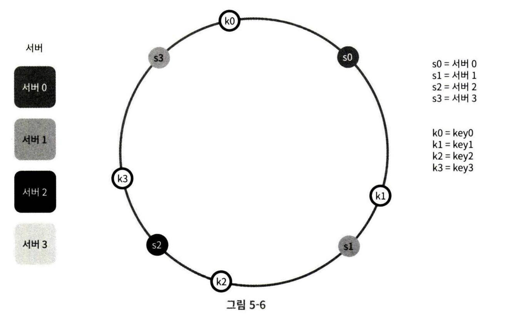
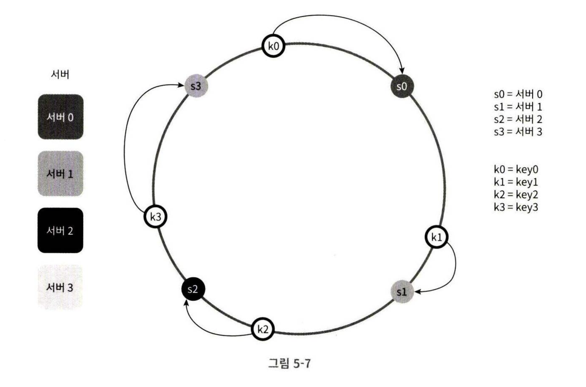
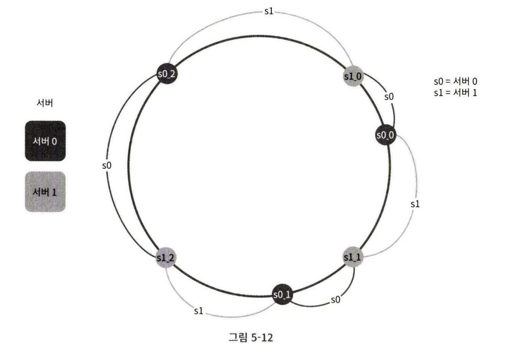

# 5장 안정 해시 설계

수평적 규모 확장성을 달성하기 위해선 요청 또는 데이터를 서버에 균등하게 나누는 것이 중요하다.<br>
안정 해시는 이 목표를 달성하기 위해 보편적으로 사용하는 기술이다.

## 해시 키 재배치(rehash) 문제
N 개의 서버가 있을 때 부하를 균등하게 나눌 수 있는 보편적 방법은 아래 해시 함수를 사용하는 것이다.
```
serverIndex = hash(key) % N (N은 서버 개수이다)
```

- 각 key 는 mod 연산의 결과로 나온 serverIndex 에 해당하는 서버에 데이터가 보관된다.
- ex. key0 은 서버 1에 저장되고 클라이언트는는 캐시에 보관된 데이터를 가져오기 위해 서버 1에 접속하여야 한다.
- 여기서 문제는 무엇인가
    - 위 방식은 서버 풀 크기가 고정되어 있을 때와 데이터 분포가 균등할 때만 잘 동작한다.
    - 만약, 서버가 추가되거나 기존 서버가 삭제되는 경우 문제가 발생한다.
    - ex. 서버 1에 장애가 발생하여 동작이 중단되면?
         - 서버 풀 크기가 3으로 변하여 mod 연산 결과인 serverIndex 값이 달라진다.
         - 이에 따라 대부분의 키가 다른 서버로 재분배되고 클라이언트는 키가 없는 서버로 잘못 접속하게 될 것이다.
         - 즉, 대규모 캐시미스(cache miss)가 발생한다.
- **안정 해시는 해시 키 재배치 문제를 해결할 수 있다.**

## 안정 해시란?
- 일반 대부분의 전통적 해시 테이블은 서버의 수가 바뀌면 거의 대부분 키를 재배치한다.
- **안정 해시는 서버 풀의 변동이 있을 때도 키가 재배치되는 수를 최소화하고, 데이터를 균등하게 분포시킬 수 있는 기법이다.**
    - 따라서 수평적 규모 확장에 좋다.

### 해시 공간과 해시 링
- 해시 함수 f 는 SHA-1 을 사용한다고 했을 때, 그 함수의 출력 값 범위가 x0, x1 ... xn 이라고 하자.
- SHA-1의 해시 공간 범위는 0부터 2^160 - 1이다.
- 따라서 x0 은 0 부터 xn 은 2^160 - 1 까지 값을 가질 것이다.
- 이 0 부터 2^160 - 1 까지의 해시 공간을 양쪽 끝을 잡고 맞닿게 하여 링을 만들었을 때, 이를 해시 링이라고 한다.



### 해시 서버와 키 배치
- 서버와 해시 키는 해시 링 위 어떤 위치에 배치할 수 있다.
- 이때 사용된 해시 함수는 앞선 재배치 문제의 해시 함수(mod 연산)과는 다르다.


### 서버 조회
어떤 키가 저장되는 서버는 해당 키의 위치로부터 시계 방향으로 링을 탐색하면서 만나는 첫 번째 서버이다.


**이때 서버가 추가 및 제거된다면?**
- 서버가 추가되더라도 키 가운데 일부만 재배치하면 된다.
- 만약 새로운 서버 s4 가 k0 과 s0 사이에 배치된다면?
    - key0 만 s4 에 재배치되며 나머지 해시 키는 같은 서버에 남는다.
- 하나의 서버가 제거되어도 일부만 재배치된다.
    - 만약, 서버1 인 s1 이 제거되었다고 한다면 key1 만이 s2 로 재배치될 것이다.

___

### 기본 구현법의 두 가지 문제
안정 해시 알고리즘은 MIT 에서 제안되었는데, 그 기본 절차가 다음과 같다.
- 서버와 키를 균등 분포 해시 함수를 사용해서 해시 링에 배치한다.
- 키의 위치에서 링을 시계 방향으로 탐색하다 만다는 최초의 서버가 키가 저장될 서버이다. 

여기서, 두 가지 문제가 존재한다.

- 첫째, 서버가 추가되거나 삭제되는 상황을 감안하면 파티션의 크기를 균등하게 유지하는 게 불가능하다는 것이다.
    - 파티션이란? 인접한 서버 사이의 해시 공간이다.
    - 어떤 서버는 굉장히 작은 해시 공간을 할당 받고, 어떤 서버는 굉장히 큰 해시 공간을 할당 받을 수 있다.
    - s0 과 s2 사이에 s1 이 제거되면 파티션은 다른 파티션에 비해 2배로 커지는 상황이 발생한다.
- 둘째, 키의 균등 분포를 달성하기가 어렵다.
    - 특정 파티션(서버 사이 해시 공간)에만 key 가 여러 개가 배치되어 있다면? 
    - 시계 방향 첫 번째에 위치하는 서버에만 key 가 몰릴 것이다.
    - 이 문제를 해결하기 위해선 **가상 노드 또는 복제라 불리는 기법**이 있다.

`가상 노드 기법`
- 가상 노드는 실제 노드 또는 서버를 가리키는 노드로, 하나의 서버는 링 위에 여러 개의 가상 노드를 가질 수 있다.
- 아래 예제는 s0 이 s0_0, s0_1, s0_2 3개의 가상 노드를 가지며, s1 도 3개의 가상 노드를 가지고 있다.
- 따라서 각 서버는 하나아 아닌 여러 개의 파티션을 관리해야 한다.
    - 아래에서 s0 이라고 된 부분은 서버 0이 관리해야 하는 파티션을 의미한다.


- 만약, 여기서 key0 이 s0_0 과 s1_1 사이에 배치되었다고 해보자
- 시계방향으로 탐색하다 만나는 첫 번째 가상 노드인 s1_1 이 대상이고, 해당 노드가 가리키는 서버 1이 실제 저장할 서버가 된다.
- **즉, 시계방향으로 탐색 시 만나는 가상 노드가 가리키는 실제 서버가 저장할 서버가 되는 것이다.**
    - 따라서 가상 노드만 늘려서 배치해주면 키의 분포는 점점 더 균등해질 수 있다.
    - 하지만 가상 노드 데이터를 저장할 공간이 더 많이 필요하게 된다.
    - 따라서 타협적 결정은 필요하다. 시스템 요구사항과 환경에 맞게 가상 노드를 조정해야 한다.

___

### 재배치할 키 결정
- 서버가 추가되거나 제거되면 데이터 일부는 재배치해야 한다.
- 어떤 것이 재배치 될지는 기본 원칙인 '시계방향에서 첫 번째 만나는 노드' 를 생각하기만 하면된다.
- 만약, s3 ~ s0 구간 사이에 s4 가 추가되었다면?
    - s4 에서부터 반시계 방향으로 만나는 첫 번째 서버 s3 까지의 구간에 있는 키들을 재배치해야 할 것이다.
- 만약, s0 ~ s2 사이에 있던 s1 이 제거되었다면?
    - s1 에서부터 그 반시계 방향에 있는 최초 서버 s2 사이에 있는 키들을 재배치해야 할 것이다.

## 마치며
**안정 해시의 이점** 
- 서버가 추가되거나 삭제될 때 재배치되는 키의 수가 최소화된다. 
- 데이터가 보다 균등하게 분포하게 되므로 수평적 규모 확장성을 달성하기 쉽다.
- hotspot 키 문제를 줄인다.
    - 유명인 key 가 특정 샤드에 몰려있다면 해당 서버에만 과부하가 걸릴 수 있는 문제이다.
    - 안정 해시는 데이터를 좀 더 균등하게 분포할 수 있으므로 이러한 문제 발생 가능성을 줄인다.

**실제 쓰이는 사례**
- DynamoDB 의 파티셔닝 관련 컴포넌트
- Apache Cassandra 클러스터에서의 데이터 파티셔닝
- 디스코드 채팅 애플리케이션
- 아카마이 CDN
- 매그레프 네트워크 부하 분산기


