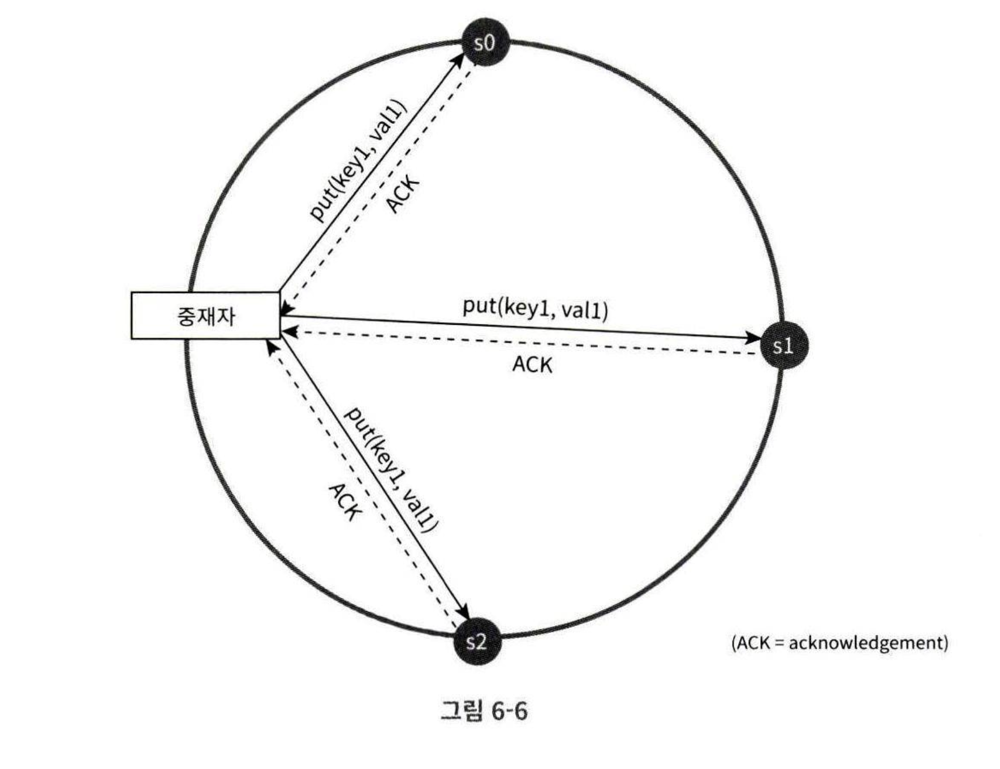
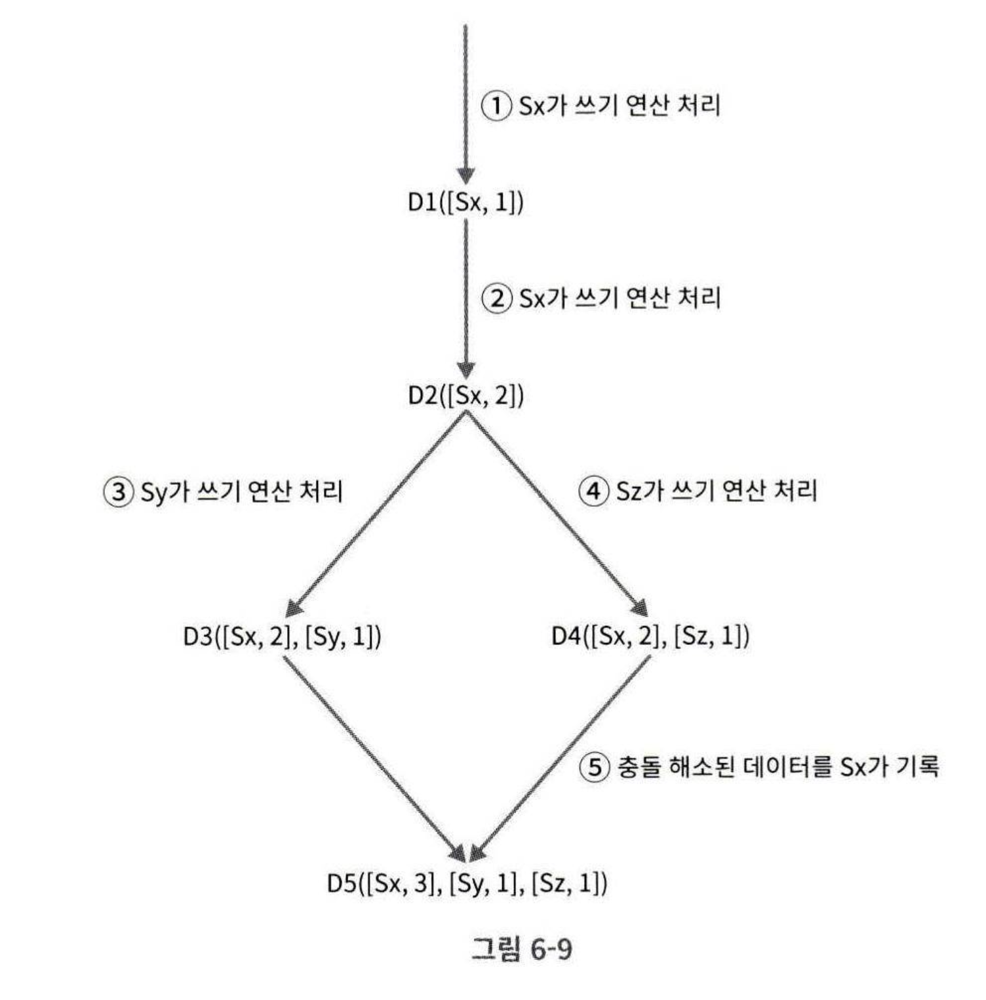
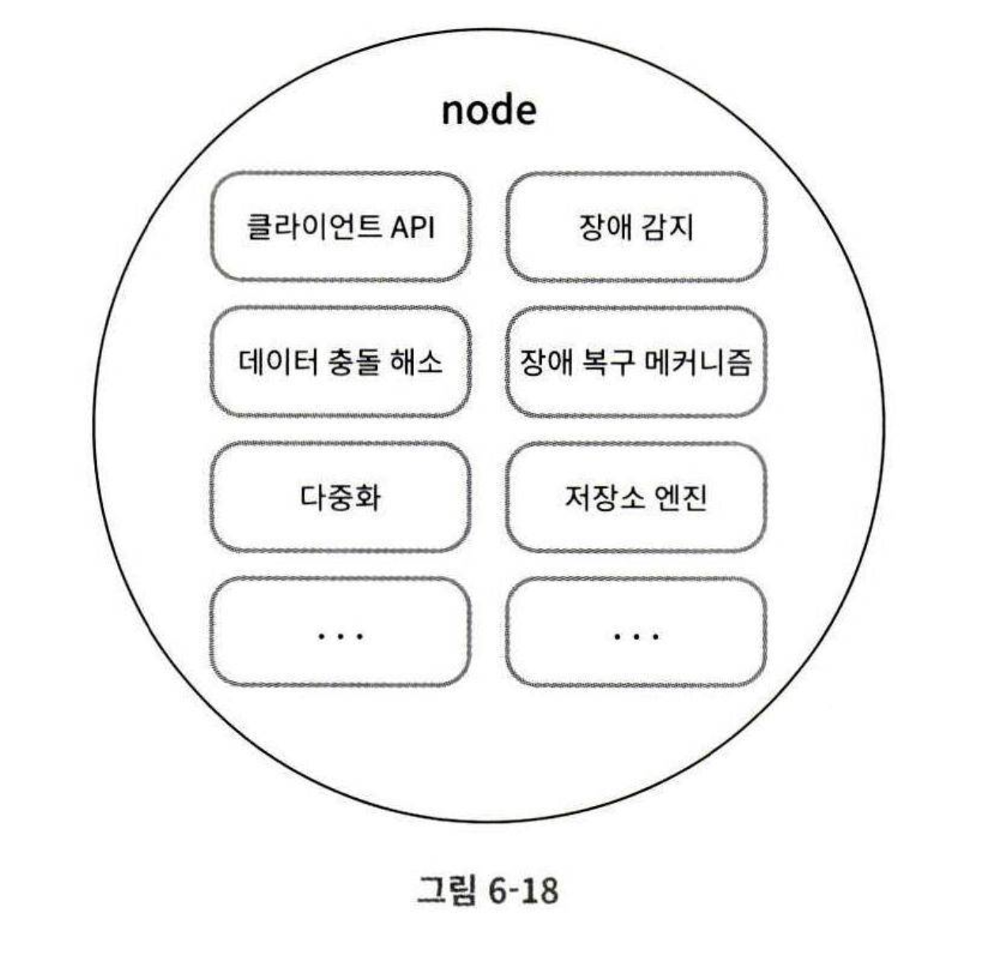

# 6장 키-값 저장소 설계
## 키-값 저장소
- 키-값 저장소는 비관계형 데이터베이스이다.
- 이 저장소에 저장되는 값은 고유 식별자 키를 반드시 가져야 한다. 
- 키-값 쌍에서 키는 유일해야 하고 해당 키에 달린 값은 키를 통해서만 접근할 수 있다.
- 키는 일반 텍스트 또는 해시 값일 수 있으며, 길이는 짧을 수록 좋다.
- 값은 문자열 또는 어떤 자료 구조나 객체일 수 있다.
    - 보통 무엇이든 다 지원한다.
- 종류: DynamoDB, memcached, redis 등

## 문제 이해 및 설계 범위 확정
**요구 사항**
- 키-값 쌍의 크기는 10KB 이하이다.
- 큰 데이터를 저장할 수 있어야 한다.
- 고가용성을 제공해야 한다. (장애가 있어도 빠른 응답)
- 높은 규모 확장성 제공
    - 트래픽 양에 다라 자동 서버 증설/삭제가 되어야 한다.
- 데이터 일관성 수준은 조정이 가능해야 한다.
- 응답 지연시간이 짧아야 한다. 즉, 빠른 성능

## 단일 서버 키-값 저장소
- 가장 직관적 방법은? 키-값 쌍을 모두 메모리에 해시 테이블로 저장하는 것이다.
- 하지만, 이는 빠른 속도는 보장하나 모든 데이터를 메모리 안에 두는 것이 불가능할 수 있다는 약점이 있다.
- 메모리 문제 해결을 위한 개선책은 다음과 같은 것이 있다.
    - 데이터 압축 
    - 자주 쓰이는 데이터만 메모리에 두고 나머지는 디스크에 저장하기
- 하지만? 결국 서버 한대는 부족할 날이 온다. 결국은 분산 저장해야 한다.

## 분산 키-값 저장소
- 분산 키-값 저장소는 분산 해시 테이블이라고도 불리며, 키-값 쌍을 여러 서버에 분산시키는 것이다.
- 분산 시스템 설계 시엔 CAP 정리를 이해해야 한다.

### `CAP 정리`
- consistency(데이터 일관성), availability(가용성), partition tolerance(파티션 감내성)을 만족해야 한다.
- 이 CAP 정리는 위 3가지 요구사항을 모두 동시에 만족하는 분산 시스템을 설계할 수 없다는 정리이다.
- 데이터 일관성: 분산 시스템에 접속하는 모든 클라이언트는 어떤 노드에 접속했냐에 관계없이 항상 같은 데이터를 보아야 한다.
- 가용성: 분산 시스템에 접속하는 모든 클라이언트는 일부에 장애가 발생해도 항상 응답을 받을 수 있어야 한다.
- 파티션 감내성:
    - 파티션이란? 두 노드 사이에 통신 장애가 발생했음을 의미한다.
    - 따라서 네트워크에 파티션이 생기더라도 시스템이 계속 동작해야 한다.
- 이 3가지 중 2가지 충족을 위해선 하나는 반드시 희생되어야 한다.
- 키-값 저장소는 3가지 중 어떤 것을 만족하느냐에 따라 분류할 수 있다.
    - CP 시스템, AP 시스템, CA 시스템
    - 이때 CA 시스템은 파티션 감내(P)를 충족시키지 못한다는 것인데, 통상 네트워크 장애는 피할 수 없는 문제이다. 따라서 분산 시스템은 파티션 문제는 언제나 감내할 수 있도로 설계되어야 하므로 일반적으로 CA 시스템은 존재하지 않는다.

**CAP 예시**
- 분산 시스템에서  보통 데이터는 여러 노드에 복제되어 저장된다.
- replica 노드 n1, n2, n3 3개의 노드가 존재한다고 해보자.
- 만약, 이상적으로 네트워크 상 파티션이 일어나지 않는다면? 
    - 항상 하나의 노드에 쓰기 연산이 일어나면 다른 두 노드에 복제가 성공적으로 이루어진다.
    - 즉, 일관성, 고가용성, 감내성은 당연히 모두 만족한다.
- 하지만, 만약 n3 가 나머지 노드와 통신할 수 없는 파티션 문제가 있다고 하자
    - n1 이나 n2 에 쓰인 것은 n3 로 복제되지 못하고, n3 에 쓰여진 것은 나머지로 복제되지 못한다.
    - 이때, 가용성과 일관성 중 하나를 택해야 한다.
    - CP 시스템(일관성이 중요할 때):   
        - 불일치 문제가 일어나면 안되므로 n1 과 n2 에 쓰기 연산을 막아야 한다.
        - 따라서 가용성이 깨지고, 상황이 해결될 때까지 사용자의 쓰기 요청은 하지 못하고 오류만 반환할 것이다.
        - ex. 온라인 뱅킹 시스템 
    - AP 시스템(가용성이 중요할 때):
        - 오래 된 데이터를 반환할 가능성이 있음에도 계속 읽기/쓰기 연산을 허용한다.
        - 그리고 파티션 문제가 해결되면 n3 에 복제할 것이다.

따라서 분산 시스템 설계 시엔 요구사항에 맞도록 CAP 정리를 적용해야 하고, 면접관과 상의해라

## 시스템 컴포넌트
키-값 저장소 구현에 사용되는 핵심 컴포넌트와 기술이다.
- 데이터 파티션
- 데이터 다중화(replication)
- 일관성
- 일관성 불일치 해소 
- 장애 처리
- 시스템 아키텍처 다이어그램
- 쓰기 경로 
- 읽기 경로

___

### 데이터 파티션
- 대규모 애플리케이션이라면 전체 데이터를 한 서버에 넣은 것은 불가능하다.
- 따라서 데이터를 파티션으로 나누어 분할하여 여러 대 서버에 저장해야 한다.
- 데이터를 파티션 단위로 나눌 때 고려할 두 가지 문제 
    - 데이터를 여러 서버에 고르게 분산할 수 있는가
    - 노드가 추가/삭제될 때 데이터의 이동을 최소화할 수 있는가

**[안정 해시](../chapter05/Consistent_Hashing.md)를 사용한 데이터 파티션의 이점**
- 안정 해시는 위 두가지 문제를 풀 수 있다.
- 규모 확장 자동화(auto scaling): 시스템 부하에 따라 서버가 자동 추가, 삭제될 수 있도록 할 수 있다.
- 다양성: 각 서버의 용량에 맞게 가상 노드의 수를 조정할 수 있다. 고성능 서버는 많이 가진다.

___

### 데이터 다중화 
- 높은 가용성과 안정성 확보를 위해선 N개의 서버에 데이터를 다중화할 필요가 있다. (N은 튜닝할 수 있는 값)
- N개의 서버를 선정하는 방법
    - 어떤 키를 링 위에 배치하고, 시계 방향으로 돌면서 만나는 첫 N개의 서버에 데이터 사본을 보관한다.
    - 하지만, 만약 가상 노드를 사용하고 있다면 선택된 N개의 노드에 대응될 실제 서버 수가 N보다 작을 수 있다.
    - 따라서 이를 피하기 위해선 같은 물리 서버를 중복 선택하지 않도록 해야 한다.
- 같은 데이터 센터에 속한 노드는 정전, 네트워크 이슈, 자연 재해 등의 문제를 같이 겪을 가능성이 있다.
    - 따라서 안정성을 위해선 데이터의 사본은 다른 센터의 서버에 보관해야 하고, 센터 간 고속 네트워크로 연결해야 한다.

___

### 데이터 일관성 
- 여러 노드에 다중화(복제)가 되었다면 일관성을 지키기 위해 적절히 동기화가 되어야 한다.
- **정족수 합의(Quorum Consensus) 프로토콜**을 사용하면 읽기/쓰기에 모두 일관성을 보장할 수 있다.

관계된 정의 
- N = 사본 개수 
- W = 쓰기 연산에 대한 정족수, 쓰기가 성공한 것으로 간주되려면 최소 W개의 서버로부터 성공 응답을 받아야 함 
- R = 읽기 연산에 대한 정족수, 읽기가 성공하려면 최소 R개 서버로부터 성공 응답을 받아야 함

N = 3 일때

- 여기서 중재자는 클라이언트와 노드 사이에 프록시 역할을 한다.
- W, R, N 의 값을 설정하는 것은 응답 지연과 데이터 일관성 사이의 trade-off 가 있으므로 타협점을 찾아야 한다.
- W = 1 또는 R = 1 인 경우
    - s0, s1, s2 로 다중화할 때 한 대에서만 쓰기 연산이 성공했다고 오면 성공했다고 간주한다.
    - 따라서 응답 속도가 빠를 것이다.
- W 이나 R > 1 인 경우
    - 시스템의 데이터 일관성 수준은 향상되나 응답 속도가 느려진다.
    - 가장 응답이 느린 서버의 응답을 기다려야 하기 때문이다.
- W + R > N 인 경우
    - 강한 일관성이 보장된다.
    - 일관성을 보증할 최신 데이터를 가진 노드가 최소 하나는 겹치기 때문이다.
- 어떤 기준으로 설정하는가? 요구되는 일관성 수준에 따라서 값을 조정하면 된다.
    - R = 1, W = N : 빠른 읽기 연산에 최적화된 시스템
    - W = 1, R = N : 빠른 쓰기 연산에 최적화된 시스템
    - W + R > N : 강한 일관성이 보장 (보통 N = 3, W = R = 2)
    - W + R <= N : 강한 일관성이 보장되지 않음

**`일관성 모델(consistency model)`**

일관성 모델은 데이터 일관성의 수준을 결정하는 모델로, 키-값 저장소 설계 시 고려할 중요한 요소이다.

**종류**
- 강한 일관성: 
    - 모든 읽기 연산은 가장 최근에 갱신된 결과를 반환한다. 즉, 절대 낡은 데이터를 보지 못한다.
    - 일반적 방법으론 모든 사본에 현재 쓰기 연산의 결과가 반영될 때까지 해당 데이터에 대한 읽기/쓰기를 금지할 수 있다. 
    - 하지만, 고가용성 시스템엔 적합하지 않다. (모든 동기화가 완료될 때까지 새 요청의 처리가 거부되므로)
- 약한 일관성: 읽기 연산은 가장 최근에 갱신된 결과를 반환하지 못할 수 있다.
- 최종 일관성(eventual consistency): 
    - 약한 일관성의 한 형태로, 갱신 결과가 결국에는 모든 사본에 반영(동기화)되는 모델이다.
    - DynamoDB 나 카산드라 같은 저장소에선 최종 일관성 모델을 택하고 있다.
    - 이 모델은 **쓰기 연산이 병렬적으로 발생하면서 일관성이 깨질 수 있는데, 이 문제를 클라이언트가 해결해야 한다.**
    - 즉, 클라이언트측에서 데이터 버전 정보를 사용하여 일관성이 깨진 데이터를 읽지 않도록 하는 것이다.

`비 일관성 해소 기법: 데이터 버저닝(versioning)`
- 데이터 다중화로 인해 일관성이 깨지는 문제는 데이터 버저닝과 벡터 시계(vector clock)로 해결할 수 있다.
- 버저닝은 말그대로 데이터를 변경할 때마다 해당 데이터의 새로운 버전을 만드는 것이다.
    - 따라서 각 버전의 데이터는 변경 불가능(immutable)하다.
- 문제 상황
    - s1, s2 가 각 n1, n2 로 get("name") 을 한 후, 거의 동시에 값을 변경한다고 하자
    - s1 이 n1 에 put("name", "new1"), s2 가 n2 에 put("name", "new2") 했을 때 충돌하는 두 값을 가진다.
    - 이 충돌을 자동으로 해결하기 위한 버저닝 시스템이 필요하고, 버저닝은 백터 시계라는 기술이 적용된다.

**벡터 시계(vector clock)**
- [서버, 버전]의 순서쌍을 데이터에 매단 것이다.
- 이는 어떤 버전이 선행 버전이고, 후행 버전인지, 다른 버전과 충돌이 있는지 판별하는데 쓰인다.
- 벡터 시계는 D([s1, v1], [s2, v2], ..., [sn, vn]) 과 같이 표현한다고 하자
    - D 는 데이터
- 만약, 데이터 D를 서버 si 에 기록하면, 시스템은 아래 작업 중 하나를 수행해야 한다.
    - [si, vi] 가 있으면 vi 를 증가시킨다.
    - 그렇지 않다면 [si, 1] 를 만든다.
 

- 여기서 주의할 것은 sy 와 sz 가 동시에 쓰기 연산을 처리할 때이다.
- 동시에 데이터 쓰기 연산이 들어와서 각각 백터 시계 상태에 [sy, 1] 과 [sz, 1] 가 생겼다.
- 이때 어떤 클라이언트가 D3 과 D4 를 읽으면 데이터 간 충돌이 있다는 것을 알 수 있다.   
    - 이 충돌은 클라이언트가 해소한 후 서버에 기록한다.
    - 쓰기 연산을 처리한 서버가 sx 라면 D([sx, 3],[sy, 1],[sz, 1]) 이 된다.

**충돌은 어떻게 감지하는가**
- 벡터 시계를 사용하면 어떤 특정 버전의 데이터 X 가 다른 버전 Y 의 이전 버전인지를 쉽게 알 수 있다. 
    - Y 에 포함된 모든 구성요소의 값이 X에 포함된 다른 구성요소 값보다 같거나 큰지만 보면 된다.
- X 와 Y 사이에 충돌이 있는지 판단하는 법
    - Y 의 구성 요소 중 X 에 있는 동일 서버 구성요소보다 작은 값을 가지는 것이 있는지 보면 된다.
    - 단, 모든 Y 의 구성요소가 작은 값을 가진다면 Y 는 X 의 이전 버전이다.
    - D([s0, 1], [s1, 2]) 와 D([s0, 2], [s1, 1]) 은 서로 충돌한다.

**벡터 시계의 단점**
- 첫째, 충돌 감지 및 해소 로직을 클라이언트가 처리하므로, 클라이언트 구현이 복잡해진다.
- 둘째, [서버, 버전] 쌍 개수가 매우 빨리 늘어난다.
    - 이 문제를 해결하기 위해선 임계치를 설정하고, 그 이상으로 길이가 길어지면 오래된 순서쌍을 제거하도록 해야 한다.
    - 하지만, 이 경우 버전 간 선후 관계가 정확하게 결정될 수 없어 충돌 해소 과정의 효율성이 낮아진다.
    - 하지만, Amazon DynamoDB 관계 문헌에 따르면 실제로 그런 문제는 발생한적이 없다고 한다! 
    - 따라서 벡터 시계는 대부분 적용해도 괜찮은 좋은 솔루션이다.

___

### 장애 감지
- 분산 시스템에선 한 대의 서버가 서버가 특정 서버가 죽었다고 알린다고 해서 바로 장애처리 하진 않는다.
- 보통 두 대 이상의 서버에서 장애를 보고해야 해당 서버에 실제 장애가 발생했다고 판단한다.
- 가장 손쉬운 방법
    - 모든 노드 사이에 멀티캐스팅 채널을 구축하는 것
    - 하지만, 당연히 서버가 많아지면 많아질 수록 비효율적이다.
- 효율적인 방법
    - 가십 프로토콜 같은 분산형 장애 감지 솔루션 사용

`가십 프로토콜(gossip protocol)`

동작 원리
- 각 노드는 멤버십 목록을 유지, 목록은 각 멤버 ID 와 heartbeat counter 쌍으로 이루어짐
- 각 노드는 주기적으로 자신의 counter 를 증가시킴
- 각 노드는 무작위로 선정된 노드들에게 주기적으로 자신의 counter 목록을 보냄
- counter 목록을 받은 노드는 최신값으로 목록 갱신하는데, 
- 어떤 멤버의 counter 값이 지정된 시간 동안 갱신되지 않은 것을 발견한 모든 노드들은 해당 노드를 장애(offline)로 판단

___

### 일시적 장애 처리
- 가십 프로토콜로 장애를 감지했다면 가용성을 보장하기 위해 시스템은 조치가 필요하다.
- 느슨한 정족수 접근법
    - 쓰기 연산을 수행할 W개의 건강한 서버, 읽기를 수행할 R개의 건가안 서버를 링에서 고른다.
- 장애 상태인 서버로 가는 요청은 일시적으로 다른 서버가 맡아 처리한다.
    - 이 동안에 발생한 변경은 장애 서버가 복구되었을 때 일괄 반영하여 일관성을 보존한다.
    - 이를 위해선 임시로 맡았던 서버는 단서(hint)를 남긴다.
    - 이러한 장애 처리 방안을 **단서 후 임시 위탁(hinted handoff)** 이라고 한다.

___

### 영구 장애 처리
- 영구적 장애 노드가 생긴 경우엔 반-엔트로피(anti-entrophy) 프로토콜을 구현하여 사본들을 동기화해야 한다.
- 반-엔트로피는 사본들을 비교하여 최신 버전으로 갱신하는 과정을 포함한다.
- 사본 간의 일관성이 깨진 상태를 탐지하고 전송 데이터의 양을 줄이기 위해선 **머클 트리(Merkle tree)** 를 사용한다.
- 머클 트리는 해시 기반 트리이다. 
```
                  [5357]                     ← Root (hash(ABCD))
                     |
          -------------------------
          |                       |
        [3545]                 [4603]        ← hash(AB), hash(CD)
         /    \                 /    \
     [6901] [6773]        [8601]   [7812]    
     (A)      (B)            (C)     (D)

A = hash(key1~3)
B = hash(key5~6)
C = hash(key7~9)
D = hash(key10~12)
```
- 머클 트리를 만드는 법
    - 두 복제 서버에서 key 저장 공간이 1~12 까지 일때 각 4개의 버킷으로 나눈다.
        - 즉, 각 키를 하나의 버킷에 3개씩 나누었다.
    - 버킷에 포함된 각각의 key 에 균등 분포 해시를 적용하여 해시 값을 계산한다.
    - 다음 버킷 별로 해시 값을 계산하고, 해당 해시 값을 레이블로 갖는 노드를 만든다. (4개 버킷마다 하나씩 노드 생성)
    - 자식 노드의 레이블로부터 새로운 해시 값을 계산하며, 이진 트리를 상향식으로 구성해 간다.
- 머클 트리 비교법
    - 두 서버의 루트 노드의 해시 값부터 일치하는지 확인한다. 같다면 두 서버는 같은 데이터를 갖는 것이다.
    - 만약, 다르다면 먼저 왼쪽 자식 노드끼리 해시 값을 비교하고, 그 다음 오른쪽 자식 노드 해시 값을 비교한다.
    - 이 방식을 반복하여 아래쪽으로 탐색하면 서로 다른 데이터를 가지는 버킷을 찾을 수 있고, 해당 버킷만 동기화하면 된다.
 - 머클 트리를 사용하면 동기화해야 하는 데이터의 양은 실제 존재하는 데이터 차이에만 비례한다.
    - 즉, 두 서버에 보관된 전체 데이터 양과는 무관하다.
    - 하지만, 실제로 쓰이는 시스템의 경우엔 버킷 하나의 크기가 꽤 크다는 건 알아두자.

데이터 센터에 장애가 발생했을 때를 대비해서 여러 데이터 센터에 다중화하는 것이 중요하다.

___

### 시스템 아키텍처 다이어그램
필요한 기술적 고려사항을 보았다면 아키텍처 다이어그램을 그려야 한다.

아키텍처 주된 기능
- 클라이언트는 키-값 저장소가 제공하는 두 가지 API get(key) 및 put(key, value) 와 통신한다.
- 중재자는 클라이언트에게 키-값 저장소에 대한 프록시 역할을 하는 노드이다.
- 노드는 안정 해시의 해시 링 위에 분포한다.
- 노드를 자동 추가/삭제할 수 있도록 시스템은 분산된다.
- 데이터는 여러 노드에 다중화된다.
- 모든 노드가 같은 책임을 지므로 SPOF 문제는 존재하지 않는다.

분산된 설계이므로 분산된 모든 노드는 아래에 제시된 기능 전부를 지원해야 한다.


___

### 쓰기 경로
- 쓰기 요청이 특정 노드에 전달된다면 어떤 일이 일어나는가
- 과정
    - 쓰기 요청이 커밋 로그 파일에 기록된다.
    - 데이터가 메모리 캐시에 기록된다.
    - 메모리 캐시가 가득하거나 사전에 정의된 임계치에 도달하면 데이터는 디스크에 있는 SSTable 에 기록된다.(flush)
        - SSTable 은 Sorted-String-Table 로, 키-값 쌍을 정렬된 리스트 형태로 관리하는 테이블이다.

### 읽기 경로
- 읽기 요청을 받은 노드는 데이터가 메모리 캐시에 있느지부터 살핀다.
- 있는 경우엔 해당 데이터를 클라이언트에게 반환한다.
- 만약, 데이터가 캐시에 없다면 디스크에서 가져와야 한다.
    - 어느 SSTable 에 대상 키가 있는지 알아낼 효율적인 방법이 필요해진다.
    - 이런 문제를 해결하기 위해선 블룸 필터(Bloom Filter)가 흔히 사용된다.
    - 블룸 필터를 먼저 거쳐서 어떤 SSTable 에 키가 있는지 알아내고 해당 위치에서 데이터를 가져올 수 있다.

## 요약

아래는 분산 키-값 저장소가 가져야 하는 기능과 기능 구현에 필요한 기술이다.
| 목표/문제                     | 기술                                                                 |
|------------------------------|----------------------------------------------------------------------|
| 대규모 데이터 저장            | 안정 해시를 사용해 서버들에 부하 분산                                 |
| 읽기 연산에 대한 높은 가용성 보장 | 데이터를 여러 데이터센터에 다중화                                     |
| 쓰기 연산에 대한 높은 가용성 보장 | 버저닝 및 벡터 시계를 사용한 충돌 해소                                |
| 데이터 파티션                 | 안정 해시                                                             |
| 점진적 규모 확장성            | 안정 해시                                                             |
| 다양성(heterogeneity)        | 안정 해시                                                             |
| 조절 가능한 데이터 일관성     | 정족수 합의(quorum consensus)                                       |
| 일시적 장애 처리              | 느슨한 정족수 프로토콜(sloppy quorum)과 단서 후 임시 위탁(hinted handoff) |
| 영구적 장애 처리              | 머클 트리(Merkle tree)                                               |
| 데이터 센터 장애 대응         | 여러 데이터 센터에 걸친 데이터 다중화                                |


