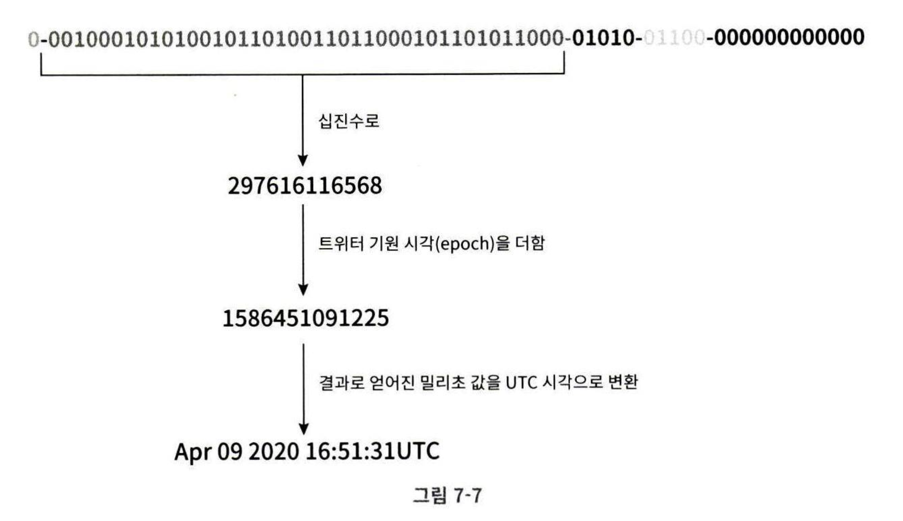

# 7장 분산 시스템을 위한 유일 ID 생성기 설계
유일 ID 대신 auto_increment 기본 키를 사용한다면?

분산 환경에서 데이터베이스가 분산되어 있을 때 이 방법은 사용하기 어렵다.

## 1단계 문제 이해 및 설계 범위 확정
1단계는 항상 질문을 통해 요구사항의 모호함을 없애고 정확히 설계 방향을 정하는 것.

**요구사항 정리**
- ID 는 어떤 특성을 가질까? 유일해야 하고, 정렬 가능해야 한다.
- 새로운 레코드의 ID 는 항상 1만큼 커야 하는가?
    - 꼭 1씩 증가한다고는 할 수 없지만 시간 흐름에 따라 항상 커진다.
- ID 는 숫자로만 구성되는가? 64비트로 표현될 수 있는 숫자로만 구성된다.
- 시스템 규모는 어느정도인가?
    - 초당 10,000개의 ID 를 생성할 수 있어야 한다.
 
 ## 2단계 개략적 설계안 제시 및 동의 구하기 
 유일성이 보장되는 ID 를 만드는 방식은 여러가지가 있다. 
 - 다중 마스터 복제(multi-mater replication)
 - UUID(Universally Unique Identifier)
 - 티켓 서버(ticket server) 
 - 트위터 스노플레이크(twitter snowflake) 접근법

___

### 다중 마스터 복제(multi-master replication)
- 여러 데이터베이스의 auto_increment 기능을 활용하고 다음 ID 값을 구할 때 1이 아닌 k 값을 증가시킨다.
- 동작
    - 해당 서버가 생성했던 이전 ID 값에 전체 서버의 수 k 를 더한다.
    - 물론, 각 DB 에서 처음 생성할 ID 초기값은 합의해서 정해놓아야 한다.
- 단순 k 만 더하면 되므로 규모 확장성 문제를 어느 정도는 해결한다.
    - DB 수를 늘리면 초당 생성 가능한 ID 수를 늘릴 수 있기 때문 
- 단점 
    - 여러 데이터 센터에 걸쳐 규모를 늘리기 어렵다.
    - ID 의 유일성은 보장되나, 시간 흐름에 맞추어 커지도록 보장할수 없다. 
    - 서버를 추가/삭제 시에 정상 동작하도록 만들기가 어렵다.

___

### UUID
- UUID 란? 컴퓨터 시스템에 저장되는 정보를 유일 식별하기 위한 128비트짜리 수
- UUID 값은 충돌 가능성이 지극히 낮다. 
    - 중복 UUID 가 1개 생길 확률을 50%로 올리기 위해선 초당 10 억개를 100년 동안 만드는 수준이라고 한다.
- UUID 는 서버 간 조율 없이도 독립적으로 생성 가능하다.
    - 즉, 각 웹서버에서 독립적으로 UUID 생성기를 가지고 ID 를 생성해도 문제가 없다.
    - 어차피 중복될 가능성이 거의 없기 때문이다.
- 장점
    - UUID 생성은 매우 단순하다.
    - 서버 간 조율이 필요 없어 동기화 이슈도 발생하지 않는다.
    - 각 서버가 자기가 쓸 ID 를 알아서 생성하므로 규모 확장도 쉽다.
- 단점
    - ID가 128비트로 길고, 현재 요구사항(64비트)에도 맞지 않는다.
    - ID 를 시간 순 정렬할 수 없다.
    - ID 에 숫자가 아닌 값이 포함될 수 있다.

___

### 티켓 서버(ticket server) 
- 아이디어의 핵심은 auto_increment 하는 DB 서버, 즉 티켓 서버를 중앙 집중형으로 하나만 사용하는 것이다.
- 장점
    - 유일성이 보장되는 오직 숫자로만 구성된 ID 를 쉽게 만들 수 있다.
    - 구현하기 쉽고, 중소 규모 애플리케이션에 적합
- 단점
    - 티켓 서버가 SPOF 가 되며, 장애가 발생하면 해당 서버를 이용하는 전체가 영향을 받는다. 
    - SPOF 를 피하기 위해선 여러 티켓 서버가 있어야 하며, 그렇다면 또 동기화 이슈가 발생한다.
- 플리커(flickr) 기업은 분산 기본 키를 만들어 내기 위해 실제 이 기술을 사용

___

### 트위터 스노플레이크(twitter snowflake) 접근법
- 트위터의 ID 생성 기법
- 64비트 ID 를 다음 구조로 나눈다.

- **사인(sign)비트:** 1비트 할당. 지금은 쓰임새가 없으나 나중을 위해 사용할 수 있다. ex. 음수/양수 구분
- **타임스탬프(timestamp):**   
    - 41비트 할당
    - 기원 시각(epoch) 이후 몇 ms 가 경과했는지를 나타내는 값이다.
    - 기원 시각은 트위터에서 구현시 사용하는 값 1288834974657 을 사용한다.
- **데이터센터 ID:** 5비트 할당, 즉 2^5 인 32개의 데이터센터 지원이 가능하다. 
- **서버 ID:** 5비트 할당, 따라서 데이터센터 당 5개의 서버를 사용할 수 있다.
- **일련 번호:** 
    - 12비트 할당
    - 각 서버에선 ID 를 할당할 때마다 이 번호를 1씩 증가시킨다.
    - 이 값은 1ms 가 경과할 때마다 0으로 초기화된다. 
- 유일하고, 규모 확장성을 지원하며, 시간 흐름에 따라 증가하고, 64비트 숫자이며 정렬 가능하다.

## 3단계 상세 설계
앞서 트위터 스노우플레이크 기법이 현재 설계안의 모든 요구사항을 만족하는 방식이었다.

- 데이터센터 ID, 서버 ID 는 시스템 시작 시 결정되며 운영 중에 바뀌지 않는다.
    - 만약, 이 값을 잘못 변경하게 되면 ID 충돌이 발생할 수 있으므로 주의해야 한다.
- 타임스탬프와 일련번호는 운영 중에 계속 만들어지는 값이다.

___

### 타임스탬프
- 타임스탬프는 기원 시각을 기준으로 얼마나 경과했는지, 즉 시간 흐름에 따라 계속 증가한다.
- 따라서 결국 ID 는 시간 순으로 정렬이 가능하다.
- 앞서 본 ID 구조의 이진 표현 형태에서 UTC 시각을 추출할 수 있다.
    - 역으로 UTC 시각도 타임스탬프 값으로 변환할 수가 있다.

- 41비트로 표현 가능한 타임스탬프의 최댓값은 2^41 - 1 = 2199023255551 ms 이다.
- 즉 대략 69년에 해당하는 값이다.
- 따라서 이 ID 생성 방식은 69년동안만 정상 동작하는데, 69년이 지나면 기원 시각을 바꾸거나 ID 체계를 다른 것으로 이전해야 할 것이다.

___

### 일련번호
- 일련번호는 12비트, 즉 2^12 = 4096개 값을 만들 수 있다.
- 1ms 지나면 0으로 초과되므로 어떤 서버가 같은 밀리초에 하나 이상의 ID 를 만든 경우에만 0 보다 큰 값을 가진다.

## 4단계 마무리
다음과 같은 사항을 추가 논의할 수 있다. 
- 시계 동기화(clock synchronization)
    - 앞선 설계안에선 ID 생성 서버들이 전부 같은 시계를 사용한다고 가정했다.
    - 하지만 이러한 가정은 여러 코어나, 여러 장비에서 서버가 동작되는 경우 유효하지 않을 수 있다. 
    - 시계 동기화 문제는 NTP(Network Time Protocl) 을 이용하여 보편적으로 해결할 수 있다.
- 각 절(section)의 길이 최적화
    - 동시성이 낮고 수명이 긴 애플리케이션이라면 타임스탬프를 늘리고 일련번호를 줄이는 것이 나을 수 있다.
- 고가용성(HA)
    - ID 생성기는 필수 불가결 컴포넌트이므로 아주 높은 가용성이 요구된다.
