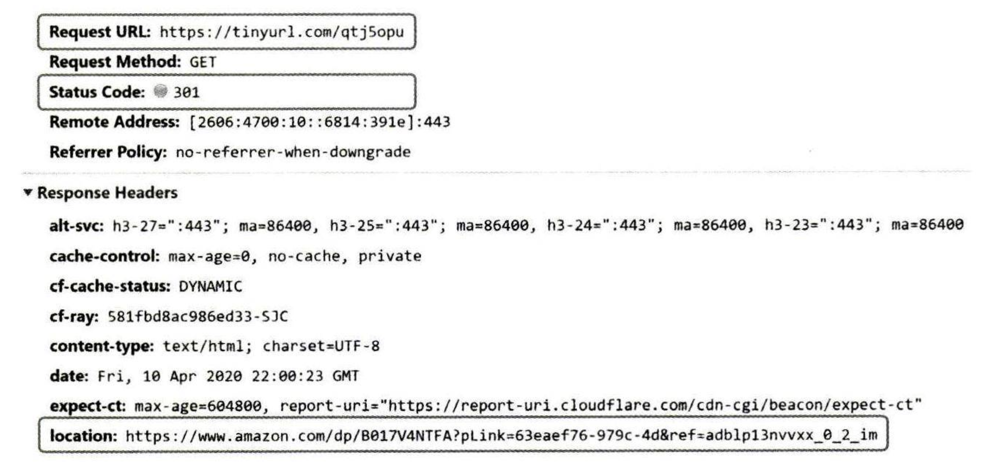
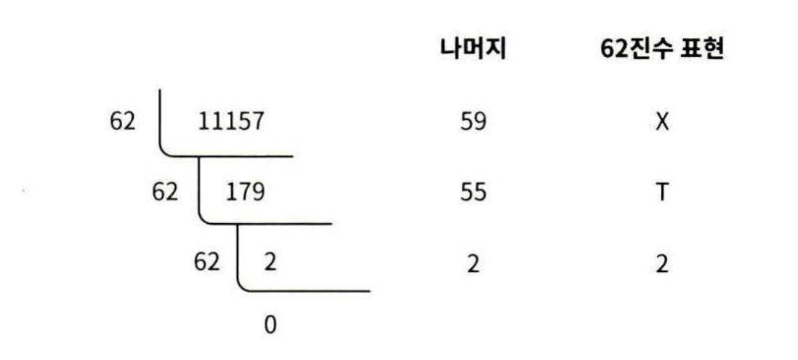
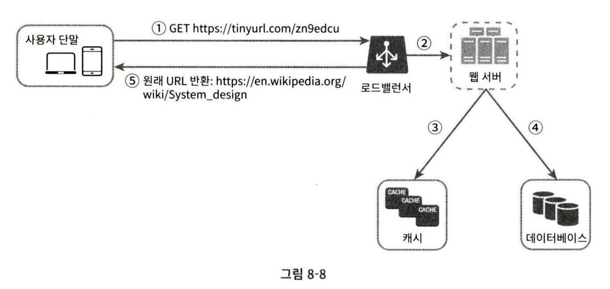

# 8장 단축기 설계
URL 단축기란?
- 말그대로 긴 주소를 짧은 주소로 변환해주며, 주소를 열면 원래 긴 주소로 리다이렉트된다.
- 목적
    - 이메일이나 SMS 전송, SNS 에서 링크 공유 등 에서 길이와 가독성 문제를 해결한다.
    - 클릭 시 URL 이동 전 사용자 통계 수집 등 부가적인 기능 제공
    - 긴 파라미터나 토큰 등을 내부로 숨겨 외부 노출을 최소화
    - QR 코드 최적 (짧을수록 QR 코드의 한칸(모듈)의 크기가 커져 스캔 인식 안전성이 커지고 인쇄 품질 향상)

## 1단계 문제 이해 및 설계 범위 확정
시스템의 기본 기능
- URL 단축: 주어진 긴 URL 을 훨씬 짧게 줄인다.
- URL 리다이렉션: 축약된 URL 로 HTTP 요청이 오면 원래 주소로 안내한다.
- 높은 가용성과 규모 확장성, 장애 감내

### 개략적 추정
- 쓰기 연산: 매일 1억 개의 단축 URL 을 생성할 수 있어야 함
- 초당 쓰기 연산: 1억 / 24 / 3600 = 1160 (초당)
- 읽기 연산: 읽기 연산과 쓰기 연산 비율이 10:1 이라고 하면 읽기는 초당 11600 회 발생
- URL 단축 서비스를 10년 운영한다고 하면 1억 x 365 x 10년 = 3650억 개의 레코드 보관이 필요
- 축약 전 URL 평균 길이가 100이라고 하면?
    - 10년 동안 필요한 저장 용량은 3560억 x 100바이트 = 36.5TB 이다. 

## 2단계 개략적 설계안 제시 및 동의 구하기
### API 엔드포인트
- 서버가 제공하는 REST API 엔드포인트를 통해 클라이언트와 통신한다.
- URL 단축기는 기본적으로 아래 두 endpoint 가 필요하다.
- **URL 단축용 엔드포인트:** 
    - `POST /api/v1/data/shorten`
    - 클라이언트는 단축할 URL 을 인자로 실어 POST 요청을 보낸다.
    - 인자 {longUrl: longURLstring}
    - 응답: 단축 URL
- **URL 리다이렉션용 엔드포인트:**
    - `GET /api/v1/shortUrl`
    - 단축 URL 접속 요청을 하면 원래 주소로 보내기 위한 엔드포인트
    - 반환: 리다이렉션될 원래 URL

___

### URL 리다이렉션
아래는 브라우저에 단축 URL 을 입력했을 때 응답이다.

- 서버는 단축 URL 을 받아 원래 URL 을 301 응답의 location 헤더에 넣어 응답한다.
- 클라이언트는 이후 응답 받은 원래 URL 로 방문하게 된다. 
- **301 과 302 응답 차이**
    - `301 Permanently Moved`: 이 응답은 요청한 URL 처리(단축 URL)의 책임이 location 헤더에 반환된 URL 주소로 이전되었음을 의미한다. 영구 이전이므로 브라우저는 이 응답을 캐시한다. 따라서 이후 같은 URL 요청을 보내면 브라우저는 캐싱된 원래 URL 로 바로 요청을 보낸다.
    - `302 Found`: 주어진 URL 요청이 '일시적으로' location 헤더에 반환된 URL 에 의해 처리되어야 함을 의미한다. 따라서 클라이언트 요청은 언제나 단축 URL 서버에 먼저 보내지고 원래 주소로 리다이렉션된다.
- 서버 부하를 줄이는 것이 중요하다면 301 응답이 좋다. 첫 요청만 단축 URL 서버로 가기 때문이다.
- 하지만, 트래픽 분석이 중요하다면 302 응답이 클릭 발생률이나 발생 위치 추적에 더 유리하다.

**URL 리다이렉션을 구현하는 방법**
- 가장 직관적인 방법은 해시 테이블을 사용하는 것이다.
- 해시 테이블에 [단축 URL, 원래 URL] 쌍을 저장한다.
    - get(shortUrl) 로 가져와 location 헤더에 넣어 응답하면 간단하다.

___

### URL 단축
- 단축 URL 이 www.tinyurl.com/{hashValue} 라고 하자. 
- 중요한 건 긴 URL 을 input 으로 hashValue 값을 반환할 해시 함수 fx 를 찾는 것이다.
- **해시 함수의 요구사항**
    - 입력이 다르면 결과값도 달라야 한다.
    - 계산된 해시 값은 원래 입력으로 주어진 긴 URL 로 복원될 수 있어야 한다.

## 상세 설계
### 데이터 모델
- 해시 테이블 구현 방식은 간단하나 실제 시스템에서 메모리 유한성으로 인해 쓰기 어렵다.
- 따라서 [단축 URL, 원래 URL] 쌍을 RDB 에 저장하는 것이다. 
- 간단한 테이블 설계
    - pk(id)
    - shortUrl
    - longUrl
    - 참고로 이 외의 더 많은 컬럼은 가질 수 있다.

___

### 해시 함수
- 해시 함수는 긴 URL 을 단축 URL 로 변환하기 위해 필요하다.

**해시 값 길이**
- 해시 함수의 아웃풋을 hashValue 라고 하자. hashValue 는 [0-9, a-z, A-Z] 문자로 구성된다.
- 따라서 사용할 수 있는 문자의 개수는 10 + 26 + 26 = 62개이다. 
- hashValue 길이 n 결정
    - 앞서 10년동안 매일 1억개를 만들면 총 3560억개가 만들어진다고 했다.
    - 따라서 62^n >= 3650억을 만족하는 n 최솟값을 구해야 한다.
    - 이때 n = 7 이 될 때 3.5조가 되므로 요구사항을 만족시킬 수 있다. 따라서 길이를 7로 결정한다.

해시 함수 구현에 쓰일 기술에는 두 가지 '해시 후 충돌 해소' 와 'base-62 변환' 법이 있다.

**`해시 후 충돌 해소`**
- 긴 URL 문자를 7글자 문자열로 줄이는 해시 함수가 필요하다. 
    - CRC32, MD5, SHA-1 과 같은 알려진 해시 함수를 이용할 수 있다.
    - 해시 결과 길이는 CRC32 < MD5 < SHA-1 이다.
    - 하지만, 가장 해시값이 가장 짧은 CRC32 7보다는 길다.
- 해시 함수 결과값을 앞 7글자만 사용하면 가장 간단하지만, 해시 결과 충돌 가능성이 높아 충돌 해소 과정이 별도 필요하다.
- 해시 결과 충돌 해소법
    - 나온 hashValue 즉, shortUrl 이 DB 에 있는지 확인한다.
    - 없다면 DB 에 저장하고 반환한다.
    - 있다면? longURL 에 사전에 정한 문자열을 덧붙여 다시 input 으로 넣어 해시값을 뽑는다.
    - 충돌이 일어나지 않을 때까지 반복한다.
- 이 방법의 단점 
    - 단축 URL 을 생성할 때마다 한번 이상 DB 쿼리를 보내므로 오버헤드가 크다.
- 블룸 필터(bloom filter) 사용하기 
    - DB 대신 사용하여 성능을 올릴 수 있다.
    - 블룸 필터는 어떤 집합에 특정 원소가 있는지를 검사할 수 있도록 하는 확률론에 기초한 공간 효율이 좋은 기술이다.
    - 블룸 필터는 DB 처럼 원래 값을 저장하는 것이 아니라 그 값이 있을 수 있다, 없을 수 있다 확률 정보만을 제공

**`base-62 변환`**
- 진법 변환(base conversion)은 URL 단축기 구현 시 흔히 사용되는 접근법이다.
- 이 기법은 수의 표현 방식이 다른 두 시스템이 같은 수를 공유하여야 하는 경우 유용하다.
- 유일성을 보장하는 ID 생성기를 통해 생성한 값을 base-62 변환한다. 
    - 즉, 이미 input 이 유일성이 보장된 ID 이므로 충돌 가능성이 없다.
- 62진법은 수를 표현하기 위해 총 62개의 문자를 사용한다. 10은 a 로, 36은 z 로 대응된다.
- 만약, 10진수 11157을 62진수로 바꾼다면?
    - 2 x 62^2 + 55 x 62 + 59 x 1 = [2, 55, 59] = [2, T, X] = 2TX
    - 즉, 2TX 가 된다.

- 따라서 이 결과 shortUrl 은 https://tinyurl.com/2TX 가 된다. 

**두 접근법 비교**
| 해시 후 충돌 해소 전략                                           | base-62 변환                                                                  |
| ------------------------------------------------------- | --------------------------------------------------------------------------- |
| 단축 URL의 길이가 고정됨                                         | 단축 URL의 길이가 가변적. ID 값이 커지면 같이 길어짐                                           |
| 유일성이 보장되는 ID 생성기가 필요치 않음                                | 유일성 보장 ID 생성기가 필요                                                           |
| 충돌이 가능해서 해소 전략이 필요                                      | ID의 유일성이 보장된 후에야 적용 가능한 전략이라 충돌은 아예 불가능                                     |
| ID로부터 단축 URL을 계산하는 방식이 아니라서 다음에 쓸 수 있는 URL을 알아내는 것이 불가능 | ID가 1씩 증가하는 값이라고 가정하면 다음에 쓸 수 있는 단축 URL이 무엇인지 쉽게 알아낼 수 있어서 보안상 문제가 될 소지가 있음 |

___

### URL 단축기 상세 설계
- URL 단축기의 처리는 논리적으로 단순해야 하며 기능적으로는 언제나 동작하는 상태여야 한다.
- base-62 변한 기법으로 설계한다고 하자.
- 동작 과정
    - 입력으로 긴 URL 을 받는다.
    - DB 에 해당 URL 이 있는지 확인한다.
    - 있으면 해당 URL 에 대한 단축 URL을 반환한다.
    - 없으면 새로운 긴 URL 이므로 유일한 ID 를 생성한다.
        - ID 는 pk 로 사용된다.
    - 62진법 변환을 적용하여 ID 를 단축 URL 로 만든다.
    - ID, 단축 URL, 원래 URL 정보를 DB 에 저장하고 단축 URL 을 반환한다.
- 이때 ID 생성기의 역할
    - 용도는 단축 URL 을 만들 때 사용될 ID 를 만드는 것
    - 전역적 유일성(globally unique)이 보장되어야 한다.
    - [분산 환경에서도 유일성을 만족하는 ID 를 만드는 방법](../chapter07/UniqueID_Generator.md)

___

### URL 리디렉션 상세 설계
쓰기보다 읽기를 더 자주 하는 시스템이면 [단축 URL, 원래 URL] 쌍을 캐싱하면 성능을 높일 수 있다.

동작 흐름 
- 사용자가 단축 URL 을 클릭한다.
- 로드밸런서가 해당 클릭으로 발생한 요청을 웹 서버에 전달
- 단축 URL 이 이미 캐싱되어 있는 경우엔 원래 URL 을 바로 꺼내 응답
- 캐시에 없다면 DB 에서 꺼낸다. DB 에도 없다면 클라이언트가 잘못된 값을 요청한 것
- DB 에서 꺼낸 URL 을 캐시에도 저장하고 클라이언트에게 응답

## 4단계 마무리
다음 사항을 더욱 논의해볼 수 있다. 
- [처리율 제한 장치](../chapter04/Rate_Limiter.md) 
    - 엄청난 양의 URL 단축 요청이 들어온다면?
    - rate limiter 를 두어 IP 주소 등으로 필터링 규칙을 이용해 요청을 걸러내자
- 웹 서버의 규모 확장
    - 설계에서의 웹 계층은 무상태이므로 웹 서버를 자동 증설/삭제가 가능하다.
- 데이터베이스의 규모 확장
    - 데이터베이스 다중화하거나 샤딩으로 규모 확장성을 달성화할 수 있다.
- 데이터 분석 솔루션
    - 단축키는 비즈니스를 위한 분석에 사용할 수 있다.
    - URL 단축기에 데이터 분석 솔루션을 통합하여 어떤 링크를 얼마나 많은 사용자가 클릭했는지, 언제 클릭되는지 등을 알아낼 수 있다.
- 가용성, 데이터 일관성, 안정성
    - 대규모 시스템이 갖춰야 하는 속성이다.

