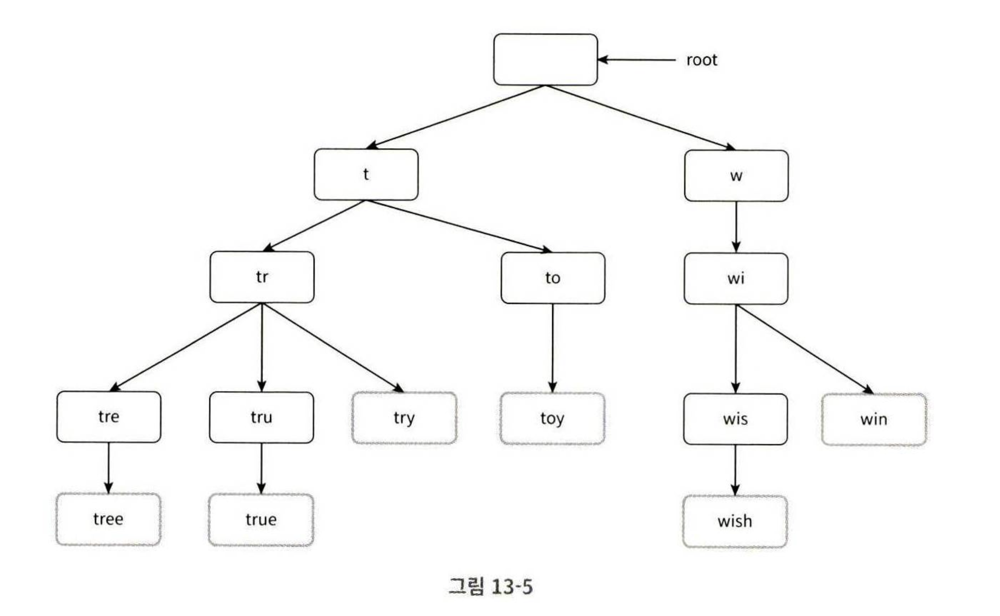
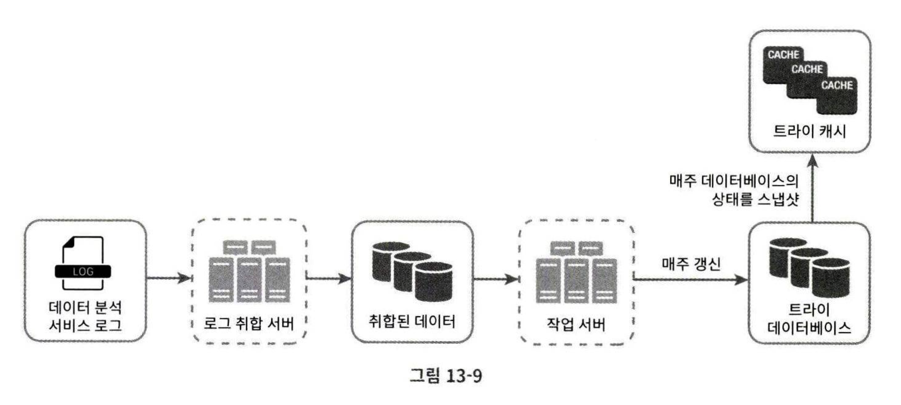
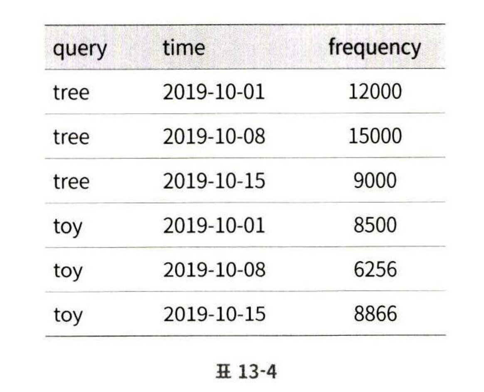
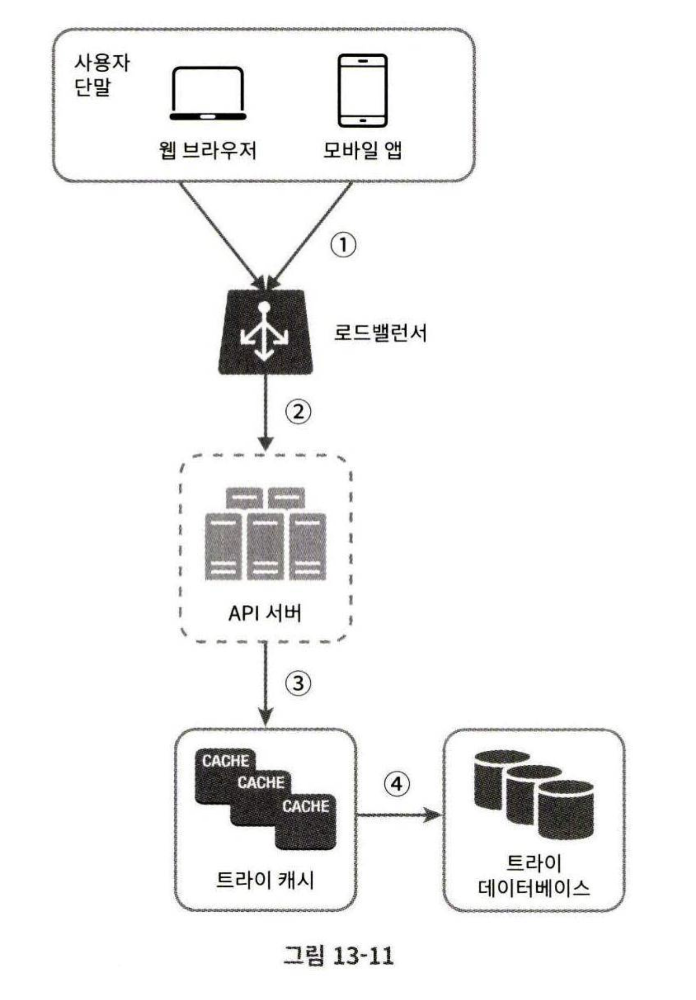
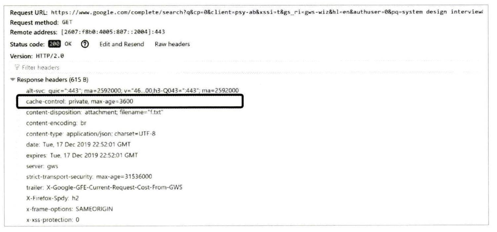

# 13장 검색어 자동완성 시스템
## 1단계 문제 이해 및 설계 범위 확정

가장 많이 이용된 검색어 k개를 자동완성하여 출력하는 시스템을 설계해보자

### 질의
- 사용자가 입력하는 단어는 자동완성될 검색어의 첫 부분 or 중간 부분? 첫 부분으로 한정.
- 몇 개의 자동완성 검색어 표시? 5개
- 자동완성 검색어를 선택하는 기준? 질의 빈도에 따른 검색어 인기 순위
- 맞춤법 검사 기능과 같은 부가 기능 제공? 없다.
- 질의는 영어인가? 영어이나 시간이 있다면 다국어 지원을 할 수 있다. 
- 대문자나 특수 문자 처리도 되어야 하는가? 모든 질의는 영어 소문자라고 가정. 
- 얼마나 많은 사용자를 수용하는가? 일간 능동 사용자(DAU) 기준 천만명.

### 요구사항
- 빠른 응답 속도
    - 페이스북은 응답속도를 100ms 이내로 두고 있다.
- 연관성: 자동완성되는 검색어는 사용자가 입력한 단어와 연관된 것이어야 함
- 정렬: 시스템의 계산 결과는 인기도 등의 순위 모델에 의해 정렬되어야 함
- 규모 확장성: 많은 트래픽 감당을 위해 확장 가능해야 함
- 고가용성: 시스템의 일부에 장애가 있어도 계속 사용 가능해야 함


### 개략적 규모 추정
- DAU는 천만 명 가정
- 평균적으로 한 사용자는 매일 10건의 검색 수행
- 질의할 때마다 평균 20byte 데이터를 입력
    - 인코딩 방법은 ASCII를 사용하면 1문자는 1바이트
    - 질의문이 평균 4개의 단어로 이루어진다고 가정하고, 각 단어가 평균 5글자로 이루어진다고 가정
    - 즉, 질의 하나 당 평균 4 x 5 = 20 byte
- 글자 타이핑마다 백엔드 API 호출, 즉 평균 1회 검색 당 20번 요청 전달
    - ex. search?q=di, search?q=din ...
- 초당 24,000 건의 질의가 발생한다고 하자
    - (천만 명 x 10 질의 x 20 자) / 24 / 3600 
- 최대 QPS = 대략 2배인 48,000 건으로 가정
- 질의 가운데 20% 가 신규 검색어라고 하면 대략 0.4GB 는 매일 시스템에 추가되어야 한다.


## 2단계 개략적 설계안 제시 및 동의 구하기

개략적으로 시스템은 두 부분으로 나뉜다.
- **데이터 수집 서비스(data gathering service):** 사용자가 입력한 질의를 실시간으로 수집하는 시스템
- **질의 서비스(query service):** 주어진 질의에 5개의 인기 검색어를 정렬해 놓는 서비스

___

### 데이터 수집 서비스
- 어떻게 동작하는가?
    - 질의문(query)과 사용빈도(frequency)를 저장하는 빈도 테이블을 만든다.
    - 질의가 수행되면 각 질의문 횟수를 카운트

### 질의 서비스
- 빈도 테이블엔 두 컬럼이 있다.
    - query: 질의문을 저장하는 필드
    - frequency: 질의문이 사용된 빈도를 저장하는 필드
- 만약 사용자가 "tw" 을 질의했을 땐 이 빈도 테이블에서 가장 빈도가 큰 top 5 를 자동완성해주면 된다.
    - 가장 간단하게는 sql 로 계산하여 결과를 줄 수 있다.
```sql
select * from frequency_table where query like 'prefix%' order by frequency desc limit 5
```
- 하지만 한계점
    - 데이터 양이 적을 땐 위 sql 질의로 충분할 수 있다.
    - 하지만, 데이터가 아주 많아진다면 데이터베이스가 병목이 될 수 있다.

## 3단계 상세 설계
위 개략적 설계안에서 데이터 수집 서비스, 질의 서비스는 처음 시스템 출발에선 괜찮다.

하지만, 아래처럼 최적화할 수 있다.
- 트라이(trie) 자료구조
- 데이터 수집 서비스
- 질의 서비스
- 규모 확장이 가능한 저장소
- 트라이 연산

____

### 트라이 자료구조
- 앞서 관계형 데이터베이스에서 sql 질의로 top 5 인기 검색어를 뽑는 것은 데이터 양의 한계가 있었다. 
- 이 문제를 해결하기 위해선 트라이를 사용할 수 있다.
- 트라이는 문자열을 간략하게 저장하고, 문자열을 꺼내는 연산에 초점을 맞추어 설계된 자료구조이다.
- trie 는 retrieval 이라는 단어에서 파생된 것

**트라이의 핵심 아이디어**
- 트라이는 트리 형태의 자료구조
- 루트 노드는 빈 문자열로 시작
- 각 노드엔 글자(char) 하나를 저장, 최대 26개(다음 등장 글자)의 자식 노드를 가진다.
- 각 트리 노드는 하나의 단어, 또는 접두어 문자열(prefix)을 나타낸다.



위와 같은 트라이 구조에서 질의에 따른 정렬된 결과를 내놓기 위해선 노드에 **빈도** 를 같이 저장한다.

___

### 트라이로 자동완성 구현하기
- 동작
    - 질의된 문자열을 나타내는 접두어를 표현하는 노드를 찾는다. 시간 복잡도는 O(p) (p = prefix 길이)
    - 해당 노드부터 하위 트리를 탐색하여 모든 유효 노드 탐색, 시간 복잡도는 O(c), (c = 주어진 노드의 자식 노드 개수)
    - 유효 노드들을 정렬하여 가장 인기 있는 검색어 k 개 찾기, 시간 복잡도는 O(clogc)
    - 즉, 총 시간복잡도는 O(p) + O(c) + O(clogc)
- 문제점: 최악의 경우 전체 트라이를 모두 탐색하는 일이 발생할 수 있음
- 해결방법
    - 접두어의 최대 길이 제한
    - 각 노드에 인기 검색어 캐시

**접두어 최대 길이 제한하는 방법**
- 사용자가 긴 검색어 입력하는 일은 거의 없음
- 따라서 prefix 값을 50과 같은 작은 정숫값으로 가정해도 무방
- 최대 길이 p 를 제한해버리면 O(p) 시간복잡도가 O(1) 로 바뀐다. 

**노드에 인기 검색어 캐시하는 방법**
- 각 노드마다 k 개의 인기 검색어를 미리 저장해놓는 방식, 즉 질의마다 탐색하지 않아도 된다.
- 자동완성은 보통 5~10개만 보여주면 충분하므로 k 는 충분히 작은 값이다.
- k = 5 일때 top 5 검색어를 노드에 캐싱해두면 실제 질의 때 응답이 매우 빠를 것이다.
- 단점
    - 노드에 저장 공간이 별도로 많이 필요
    - 하지만, 빠른 응답속도가 더욱 중요하다면 희생할 가치가 있다.

**두 가지 최적화 방안을 적용했을 때 시간복잡도**
- prefix 길이가 고정되므로 접두어 노드를 찾는 시간복잡도가 O(1) 
- 각 노드마다 검색 결과를 미리 캐싱해두면 top 5 를 찾는 시간복잡도도 O(1)
- 따라서 각 모든 단계가 O(1) 이므로 매우 빠른 응답속도를 보장

___

### 데이터 수집 서비스
앞서 설계안에선 타이핑마다 질의로 API 호출되어 실시간으로 데이터가 수정된다.

하지만, 댜음 2가지 문제로 이 설계는 실용적이지 못하다.
- 매일 수천만 건의 질의 입력 시마다 트라이가 갱신되면 질의 서비스가 심각하게 느려질 것이다.
- 인기 검색어는 자주 바뀌지 않는 특성이 있다.
    - 따라서 트라이는 그렇게 자주 갱신할 필요가 없어진다.

애플리케이션의 성격에 따라서 다르다.
- 트위터와 같은 실시간 애플리케이션이라면 검색어를 항상 신선하게 유지할 필요가 있다. (최신 반영이 큼)
- 구글같은 사이트는 비교적 자주 바꿔줄 필요가 없다.
    - 즉, 최신성이 덜 반영되도 그닥 문제가 없다.
- 성격에 따라 사용이 달라도 데이터 수집 서비스의 토대는 같다.
    - 보통 데이터 분석 서비스나 로깅 서비스의 데이터로부터 수집된다.

따라서 실시간 수정될 필요가 없다고 하자. 아래는 수정된 설계안이다.


**데이터 분석 서비스 로그**
- 검색창에 입력된 원본 데이터가 그대로 보관된다.
- 검색 시마다 새로운 데이터가 추가될 뿐 수정은 없다.
- 즉, 질의어(query) 와 검색시간(time) 을 같이 기록헤서 보관한다.

**로그 취합 서버**
- 데이터 분석 서비스로부터 나오는 로그는 양이 엄청나며 형식도 제각각일 수 있다. 
- 따라서 각 데이터를 잘 취합해서 시스템이 잘 소비할 수 있게 해야 한다.
- 데이터 취합 방식은 앱 성격에 따라 달라진다.
    - 트위터와 같이 실시간성이 중요하다면 취합 주기를 짧게 가져가야 할 것이다.
    - 하지만, 대부분 앱은 일주일에 한 번 정도로 취합해도 충분할 것이다.

**취합된 데이터**
- 일주일 기간에 축적된 검색 데이터를 취합했다고 하자.
- time 필드는 해당 주가 시작한 날짜를 나타낸다.
- frequency 는 해당 질의가 해당 주에 사용된 횟수의 합



**작업 서버**
- 주기적으로 비동기 작업(job)을 실행하는 서버 집합
- 서버의 역할
    - 취합된 데이터를 기반으로 트라이 자료구조를 만든다.
    - 트라이 데이터베이스에 저장한다.

**트라이 캐시**
- 분산 캐시 시스템을 사용하여 트라이 데이터를 메모리에 유지하여 읽기 성능을 높이는 역할을 한다.
- 매주 트라이 데이터베이스의 스냅샷을 따서 갱신한다.

**트라이 데이터베이스**
- 영구적인 지속성 저장소를 말한다.
- 다음과 같은 DB 를 사용할 수 있다.
    - `문저 저장소(document db)`: 새 트라이를 매주 만드므로, 주기적으로 트라이를 직렬화하여 db 에 저장
    - `키-값 저장소(key value)`: 트라이를 아래 로직을 통해 해시 테이블 형태로 전환하여 저장
        - 트라이에 보관된 모든 접두어를 해시 테이블 키로 변환
        - 각 노드의 모든 데이터를 해시 테이블의 값으로 변환

___

### 질의 서비스

- 동작 과정
    - 검색 질의가 로드밸런서로 전송
    - 로드밸런서는 질의를 API 서버로 보낸다.
    - API 서버는 트라이 캐시에서 데이터를 가져와서 해당 요청에 대한 자동완성 검색어 제안 응답을 구성한다.
    - 만약, 캐시에 데이터가 없다면 데이터를 데이터베이스에서 가져와 캐시에 채운다.
        - 캐시에 채워야 다음에 같은 접두어에 대한 질의가 왔을 때 캐시를 이용할 수 있다.
- 질의 서비스는 매우 빨라야 한다. 따라서 다음 최적화 방안을 사용해볼 수 있다.
    - `AJAX 요청`: 웹앱에서 보통 브라우저는 AJAX 요청보낸다. 장점은 요청을 보내고 받기 위해 새로고침이 필요없다.
    - `브라우저 캐싱`: 대부분 앱에서 자동완성 결과는 빠르게 변화하지 않는다. 따라서 이전에 요청된 결과를 브라우저에 캐싱해두면 후속 질의의 결과는 해당 캐시에서 바로 사용될 수 있다. **구글 검색 엔진** 은 이러한 캐시 메커니즘을 사용한다. 구글은 제안된 검색어를 한 시간 동안 캐시해 두는 전략을 사용한다. cache-control 의 private 은 해당 응답이 요청을 보냈던 사용자의 캐시에만 보관되고 공용 캐시에 저장되는 것이 아니라는 것이다. max-age = 3600 은 캐시가 3600초동안 유효하다는 것이다.
    
    - `데이터 샘플링`: 대규모 시스템에선 모든 질의 결과를 로깅하도록 하면 CPU 자원과 공간을 많이 소모한다. 데이터 샘플링은 모든 데이터를 로깅하는 것 대신 N 개 요청에서 1개만 로깅하도록 하는 것이다.

___

### 트라이 연산
**트라이 생성**
- 작업 서버가 주기적으로 이 생성을 담당한다.
- 데이터 분석 서비스의 로그나 데이터베이스의 데이터로부터 취합된 데이터를 기반으로 생성한다.

**트라이 갱신**
- 아래 두 가지 방법이 존재
- 매주 한번 갱신하기 
    - 새로운 트라이를 또 생성하여 기존의 것을 대체하는 것이다.
- 트라이의 각 노드를 개별적으로 갱신하기 
    - 본 설계안에선 이 방법이 아닌 매주 한번 갱신 방법이 채택된 이유는 성능이 좋지 못하기 때문
    - 하지만, 트라이가 작을 때, 즉 데이터 양이 많지 않다면 고려할 수 있다.
    - 트라이 노드 갱신 시엔 상위 그 모든 상위 노드 갱신도 필요하다. 인기 검색어 결과가 노드에 캐싱되므로
    - ex. 만약 beer 질의 빈도가 10에서 30으로 바뀌면 그 상위에서 beer 에 대한 빈도 기록도 모두 바뀌어야 함

**검색어 삭제**
- 만약, 폭력적, 성적, 욕설 등의 질의어는 자동완성 결과에서 제거되어야 한다.
- 이를 위한 방법은 트라이 캐시 앞에 `필터(filter)`를 두고 부적절한 질의어가 반환되지 않도록 하는 것이다.
    - 즉, 트라이 캐시에서 데이터를 API 서버로 가져올 때 필터링한다.
    - 필터를 두면 필터링 규칙에 따라 검색 결과를 변경할 수 있다.
    - 필터링만 하고 DB 에서 실제 검색어를 물리적 삭제하는 일은 다음 업데이트 때 비동기적으로 진행하면 된다.

___

### 저장소 규모 확장
트라이의 크기가 하나의 저장소 서버에 저장하기에 너무 큰 경우에도 고려해야 한다.

`첫 글자 기준 샤딩`
- 영어 첫 글자 기준으로 샤딩하여 분산 저장한다.
- 만약 두 대의 서버가 필요하다면? a-m 까지는 첫 번째 서버, 나머지는 두 번째 서버에 저장
- 세 대의 서버가 필요하다면? 3등분하여 각 서버에 분산 저장
- 첫 글자를 기준으로 샤딩한다면 사용 가능한 서버는 최대 26개로만 제한된다.
- 만약, 이 이상의 서버가 더 필요한 경우?
    - 샤딩을 계층적으로 해야 한다.
    - 가령 검색어의 첫 번째 글자는 첫 번째 레벨의 샤딩에 쓰고, 두 번째 글자는 두 번째 레벨의 샤딩에 쓴다.
    - ex. "a" 로 시작하는 검색어를 4대 서버에 나눠 보관한다고 하자.
    - "aa" 부터 "ag" 까진 첫 번째 서버에, "ah" 부터 "an" 까진 두 번째 서버에 저장할 수 있다.
    - 하지만 이 경우 단점은? **데이터를 각 서버에 균등하게 배분하기가 불가능하다는 것**

`과거 질의 패턴을 분석하여 샤딩`
- 첫 글자 기준으로 샤딩하는 방식은 서버 간 균등하게 배분이 불가능하다는 한계점이 존재한다.
- 과거 질의된 양에 따라서 균등하게 샤드를 만든다.
- 예를 들어 's' 로 시작하는 검색어 양이 u ~ z 로 시작하는 검색어를 모두 합친 것과 비슷하다면?
    - 's' 대한 샤드 하나 / 'u' ~ 'z' 에 대한 샤드 하나로 나누어도 충분할 것이다.
- 이 방식은 어떤 검색어가 어느 저장소 서버에 저장되어 있는지에 대한 정보를 관리한다.
    - 관리하는 서버를 '검색어 대응 샤드 관리자'라고 한다.
- 동작
    - 해당 질의에 대한 데이터가 어느 샤드에 있는지 '검색어 대응 샤드 관리자' 에 요청
    - 해당 샤드에서 데이터 추출

## 4단계 마무리
다음 질문이 더 추가될 수 있다.
- 다국어 지원   
    - 비영어권 국가의 언어를 지원하려면 트라이에 유니코드 데이터를 저장해야 한다.
- 국가별로 인기 검색어 순위가 다른 경우엔?
    - 국가별 별도 트라이를 가진다.
    - 트라이를 CDN에 저장하여 응답속도를 높일 수도 있다.
- 실시간으로 변하는 검색어 추이를 반영하고 싶다면?
    - 본 설계안은 매주 한번 갱신하므로 실시간에 맞게 트라이를 생성할 순 없다는 한계가 있다.
    - 만약, 실시간을 맞춘다고 해도 트라이 연산에 너무 많은 시간이 들 것이다. 그래서 적합하지 않다.
    - 따라서 실시간 검색어 자동완성 시스템은 다음과 같은 방법이 필요하다.
        - 샤딩으로 작업 대상 데이터 양을 줄인다.
        - 순위 모델을 바꾸어서 최근 검색어에 높은 가중치를 준다.
        - 데이터가 스트림 형태로 올 수 있다는 점. (지속적 생성) 스트림 프로세싱을 위한 '하둡 맵리듀스'
        , spark 스트리밍, kafka 와 같은 시스템을 추가하는 것이 필요하다. 
        
